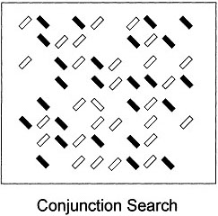
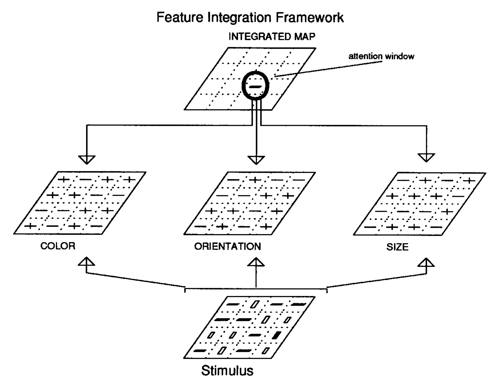

```{r setup, include=F}
knitr::opts_chunk$set(echo = FALSE, cache=TRUE, fig.align='center', fig.dim=c(4,2), dev = 'pdf')

library(tidyverse)
library(brms)
library(tidybayes)
library(modelr)
library(patchwork)
library(kableExtra)

source("helpers.R")
bikes <- read_csv("../data/bikes.csv")

theme_set(theme_bw(base_size=10) + theme(panel.grid=element_blank()))
update_geom_defaults("point", list(shape = 1, size=1))
```

## Assessing model fit

Once we fit a model, we want to know: how good is our model?

Some common measures:

- Variance accounted for: $R^2$
- Probability
  - log-likelihood (aka deviance)
  - posterior probability 
- Cross validation
- Information criteria

::: notes
20m on model comparison theory (10 slides max)
5m on feature integration theory / visual search (3 slides)
40m on multiple regression + application of model comparison (30 slides max)
10m on class business
:::


## No alarms and no surprises, please

- A good model means we should not be surprised by new observations.

- __Information theory__ gives us a measure of _surprising-ness_

$$H(p) = -E[log(p_i)]$$

- Can estimate how surprising the observed data are given our model as the log-pointwise-predictive-density:

$$\widehat{\text{lppd}} = \sum_i^N log \Bigg( \frac{1}{S}\sum_s p(y_i|\theta_s) \Bigg)$$

## Generalization

As scientists, we don't just want to describe what is happening in our sample of observations, but also to generalize to new unseen data.

So, we don't just want to know the $\text{lppd}$, we want $\text{elppd}$: the expected log posterior predictive density for new data $\tilde{y}$

$$\text{elppd} = \sum_i^N \int{\text{log}\big(\: p(\tilde{y_i}|y)\big) \, p_t(\tilde{y_i})d\tilde{y}}$$

Where $p_t(\tilde{y_i})$ is the true probability of new data $\tilde{y_i}$, which we can't know.

::: notes
Don't worry about this equation too much, point is just that we are missing a piece needed to calculate what we want
:::


## Leave-one-out cross validation

We can estimate the model's generalization performance using __cross validation__.

$$\widehat{\text{elppd}} = \sum_i^N log \, P(y_i|y_{-i}) $$

- For $n$ observations we create $n$ datasets each with one observation held out
- $n$ models are fit to each of these $n$ datasets and each time used to predict the held-out observation's value

Schematically:

\small
```r
for (i in 1:nrow(df)){
  d <- df[-i, ]
  m <- lm(y ~ x, data = d)
  pred <- predict(m, newdata = df[i, ])
  compute_error(pred, df$y[i])
}
```
\normalsize

::: notes
- earlier said we want to know how surprised we are likely to be by new data
- can estimate that with cross validation
:::

## Variance accounted for $R^2$ 

$$R^2 = \frac{Var(\text{outcome}) - Var(\text{residuals})}{Var(\text{outcome})}$$

- $R^2$ is the "proportion of variance explained" by a model.

- It is an __absolute__ measure of model fit that ranges from 0 (no fit at all) to 1 (perfect fit)

- $R^2$ is very useful, but it is also not to be trusted

- It does nothing to account for __model complexity__

::: notes
- ok that's where we're going
- let's turn to something more familiar: R2
- why are we going to be interested in cross validation? Why not just use R2?
:::

## Model complexity

- Model complexity refers to how flexible the model is to accommodate different patterns of data

- More complex models are more flexible and can fit more different patterns of data

- Adding more predictors will always increase $R^2$, even if they are not meaningful

- E.g. the model below can perfectly fit any $n$ points:

$$\mu_i = \beta_1x + \beta_2x^2 + ... + \beta_{n-1}x^{n-1}$$

## Complex models can predict perfectly (within a sample)

```{r, fig.dim=c(4,3), fig.align='center', warning=F}
df_brain_extra <- tibble( 
  species=c( "afarensis","africanus","habilis","boisei",
    "rudolfensis","ergaster","sapiens", "new"),
  brain=c( 438 , 452 , 612, 521, 752, 871, 1350, 1500 ),
  mass=c( 37.0 , 35.5 , 34.5 , 41.5 , 55.5 , 61.0 , 53.5, 58 )
  ) %>% 
  mutate(
    x = mass,
    y = brain
  )

df_brain <- df_brain_extra %>% 
  filter(species!="new")

reg_lines <- data_grid(df_brain, x = seq(min(mass)-3, max(mass)+3, length.out=100)) %>% 
  mutate(
    p1 = predict(lm(y~x, data=df_brain), newdata= .),
    p2 = predict(lm(y~poly(x,2), data=df_brain), newdata = .),
    p3 = predict(lm(y~poly(x,3), data=df_brain), newdata = .),
    p4 = predict(lm(y~poly(x,4), data=df_brain), newdata = .),
    p5 = predict(lm(y~poly(x,5), data=df_brain), newdata = .),
    p6 = predict(lm(y~poly(x,6), data=df_brain), newdata = .),
  ) %>% 
  gather(poly_term, pred, p1:p6) %>% 
  mutate(poly_term = gsub("p","degree = ", poly_term))

ggplot(reg_lines, aes(x=x)) +
  geom_line(aes(y=pred)) +
  geom_point(data = df_brain, aes(y=y), color="blue", size=2) +
  geom_hline(yintercept=0, linetype="dashed") +
  facet_wrap(~poly_term) +
  ylim(-500, 2000) +
  theme(aspect.ratio=1)
```

## But complex models fail to generalize

Overly-complex models often make very poor predictions about unseen data.

```{r, fig.dim=c(4,3), fig.align='center', warning=F}
ggplot(reg_lines, aes(x=x)) +
  geom_line(aes(y=pred)) +
  geom_point(data = df_brain_extra, aes(y=y, color=species=="new"), size=2) +
  geom_hline(yintercept=0, linetype="dashed") +
  scale_color_manual(values=c("blue","red")) +
  facet_wrap(~poly_term) +
  ylim(-500, 2000) +
  theme(legend.position = "none", aspect.ratio = 1) +
  labs(y = "y", x = "x")
```


## Overfitting

- The more flexible the model, the more it is affected by the specific observations to which it is fit
- When this phenomenon creates problems, it is called "overfitting"

```{r, fig.dim=c(4,2), fig.align='center', warning=F}
cv_func_reg_line <- function(i, df, degree){
  d <- df[-i,]
  f <- lm(brain ~ poly(mass, degree), data = d)
  pred <- predict(f, newdata=data_grid(df, mass = seq_range(mass, n = 500)))
  pred
}

z <- df_brain_extra %>% 
  mutate(degree=1) %>% 
  bind_rows(
    df_brain_extra %>% 
      mutate(degree=6)
  ) %>% 
  mutate(
    degree = paste("degree = ", degree)
  )

expand_grid(
  cv_ind = 1:nrow(df_brain_extra),
  degree = c(1,6)
) %>% 
  mutate(
    preds = map2(cv_ind, degree, ~cv_func_reg_line(.x, df_brain_extra, .y)),
    mass = list(seq_range(df_brain_extra$mass, n = 500)),
    degree = paste("degree = ", degree)
  ) %>% 
  unnest(preds, mass) %>% 
  ggplot(aes(x=mass, y = preds, group=cv_ind)) +
  geom_point(data =  z, aes(x = mass, y = brain), inherit.aes=FALSE, color="blue", size=2) +
  geom_line(alpha=.25) +
  geom_hline(yintercept=0, linetype="dashed") +
  facet_wrap(~degree) +
  # ylim(-100, 2500) +
  scale_y_continuous(limits = c(-500, 5000), expand=c(0,0)) +
  scale_x_continuous(expand=c(0,0)) +
  labs(y = "y", x = "x")

```

::: notes
- The plot below shows how the regression lines for the simple linear model and the 6-degree polynomial model.
- there are 7 regression lines, each fit holding out one observation 
- the simple model is hardly affected at all, but the complex model is wildly different


- occam's razor
- "entities should not be multiplied beyond necessity"
- received as the simplest explanation is usually the best one."
- this is one reason to believe this principle / use the razor

:::


## Information criteria

- __Information Criteria__ are a kind of model fit measure that approximate out-of-sample predictive accuracy

- Some examples:
  - AIC
  - WAIC
  - LOOIC
  
::: notes
- We will generally use LOOIC, but we'll start with an explanation of _AIC_ and _WAIC_ which are a bit simpler to describe.
:::

## Akaike Information Criteria

- The ___Akaike Information Criteria___ (_AIC_) is the simplest approximations of leave-one-out cross validation

$$\widehat{\text{elpd}}_{\text{AIC}} = log\;p(y|\hat{\theta}_{mle}) - k$$

- To turn this into the information criteria statistic, it is conventional to multiply this by $-2$.

$${\text{AIC}} = -2(log\;p(y|\hat{\theta}_{mle}) - k)$$

- For information criteria, __lower numbers indicate better model fit.__

::: notes
- based on the maximum likelihood estimate of a model's parameters
- k is number of parameters
:::

## Leave-One-Out Information Criteria (LOOIC)

- _LOOIC_ is a newer better approximation to leave-one-out cross validation

- The `brms` function `loo()` uses some clever math to directly estimate $\widehat{\text{elppd}}_{\text{loo}}$ without actually having to re-fit the model for each of the $n$ data points.

- In this class we will usually work with $\widehat{\text{elppd}}_{\text{loo}}$ rather than _LOOIC_ (which is multiplied by $-2$)

- Remember: Everything that depends on parameters has uncertainty, and this includes $\widehat{\text{elppd}}_{\text{loo}}$ and _LOOIC_

::: notes
- another reason to prefer over R2: elppd is THE THING that we want, for all models
:::

## Estimating model complexity with `loo()`

- `loo()` will also estimate the "effective number of parameters" $\hat{p}_{\text{loo}}$ as

$$\hat{p}_{\text{loo}} = \widehat{\text{lppd}} - \widehat{\text{elppd}_{\text{loo}}}$$

- More complex models will always have as high or higher $\widehat{\text{lppd}}$ compared with simpler models, but they will often perform worse on new data.

- Therefore, the difference between $\widehat{\text{lppd}}$ and $\widehat{\text{elppd}}$ is a measure of model complexity

::: notes
When the difference (elpd_diff) is larger than 4, the number of observations is larger than 100 and the model is not badly misspecified then normal approximation and SE are quite reliable description of the uncertainty in the difference. Differences smaller than 4 are small and then the models have very similar predictive performance and it doesn't matter if the normal approximation fails or SE is underestimated. - per: https://avehtari.github.io/modelselection/CV-FAQ.html#14_Why_(sqrt{n})_in_Standard_error_(SE)_of_LOO 
:::

# Multiple regression example

## Visual search

```{r waldo, fig.align='center', out.height="80%"}
knitr::include_graphics("../images/wheres-waldo.jpg")
```

## Feature search

```{r feat-conj-ex1, fig.align='center', fig.width=6}
knitr::include_graphics("../images/visual-search-feat.jpg")
```


## Conjunction search

```{r feat-conj-ex2, fig.align='center', fig.width=6}

```

## Feature and Conjunction search

```{r feat-conj-ex3, fig.align='center', fig.width=6}
knitr::include_graphics("../images/visual-search.jpg")
```


## Feature Integration Theory

```{r feat-int-theory, fig.align='center', out.height="80%"}

```

## Visual search data

- 18 participants randomly assigned to feature or conjunction search conditions (between subjects)
- Completed with 3, 6, 12, and 18 total items in the display
- Response times measured and averaged from approximately 400 trials for each condition
- First focusing on trials where target was present in the display
- Data collected by Jeremy Wolfe

```{r, message=F}
vizsearch <- read_csv("../data/visual-search.csv") %>% 
  mutate(
    cond_conj = if_else(condition=="feature", 0, 1),
    targ_absent = if_else(message=="HIT",0,1)
    ) %>% 
  select(subject, cond_conj, targ_absent, setsize, rt)
```

```{r, echo=T, message=F}
df1 <- vizsearch %>% 
  filter(targ_absent==0)
```

## Looking at the data

```{r, echo=T}
head(df1)
```

## Plotting the data

\scriptsize
```{r, echo=T, fig.align='center', fig.dim=c(4,2.5)}
df1 %>%
  mutate(cond_conj = factor(cond_conj)) %>%
  ggplot(aes(x = setsize, y = rt, color = cond_conj)) +
  geom_jitter(width = .5, height = 0) +
  scale_x_continuous(breaks = c(3, 6, 12, 18))
```

## Proposing the model: likelihood

\begin{align*}
  \text{rt}_i &\stackrel{iid}{\sim} Normal(\mu_i, \sigma) \\
  \mu_i &= \alpha + \beta_1 C_i + \beta_2 S_i + \beta_3 \ C_iS_i \\
\end{align*}

Remember: Each coefficient represents the effect on the outcome of a one-unit change in the predictor when all other predictors are equal to zero.

::: notes
- Because the setsize is never actually zero, I could shift the `setsize` variable so that this zero value in the model will have a meaningful interpretation.
- But I don't care terrible about the intercept or other coefficient
- Centering variables is another popular solution. But it is always nice to think about what is meaningful for your data.
:::

## Proposing the model: priors

To scale my weakly-informative priors, I first calculated the `mean` and `sd` of the data:
\scriptsize
```{r, echo=T}
mean(df1$rt)
sd(df1$rt)
```

:::::::::::::: {.columns}
::: {.column width="40%"}
\small
\begin{align*}
  \text{rt}_i &\stackrel{iid}{\sim} Normal(\mu_i, \sigma) \\
  \mu_i &= \alpha + \beta_1 C_i + \beta_2 S_i + \beta_3 \ C_iS_i \\
  \alpha &\sim Normal(500, 120) \\
  \beta_1 &\sim Normal(0, 360) \\
  \beta_2 &\sim Normal(0, 24) \\
  \beta_3 &\sim Normal(0, 24) \\
  \sigma &\sim Exponential(1/200) 
\end{align*}

:::
::: {.column width="60%"}
\scriptsize
```r
fit1 <- brm(
  rt ~ setsize + cond_conj  + setsize:cond_conj,
  prior =
    prior(normal(500, 120), class=Intercept) +
    prior(normal(0, 360), coef=cond_conj) +
    prior(normal(0, 24), coef=setsize) +
    prior(normal(0, 24), coef=`setsize:cond_conj`) +
    prior(exponential(.005), class=sigma),
  family = gaussian(),
  data = df1
  )
```

:::
::::::::::::::

```{r, message=F, results='hide'}
## moderately informative prior

fit_prior1 <- brm(
  rt ~ setsize + cond_conj  + setsize:cond_conj,
  prior =
    prior(normal(500, 120), class=Intercept) +
    prior(normal(0, 360), coef=cond_conj) +
    prior(normal(0, 24), coef=setsize) +
    prior(normal(0, 24), coef=`setsize:cond_conj`) +
    prior(exponential(.005), class=sigma),
  family = gaussian(),
  data = df1,
  sample_prior = "only"
  )
```

::: notes
brms auto-centered intercept at grand mean ~500. I let that vary by 1 sd b/c I know that puts things in a reasonble range, people can't be faster than about 250ms or 2sd different

- For other coefficients I used even less info, but made sure to respect the scaling of the variables. 
- Used 3x standard deviation. This is very loose and allows for effects we essentially never see in pscyhology, but rules out e.g. 1 million, etc.
- `cond_conj` ranges from 0 and 1
- `setsize_s` ranges from 0 to 15 (3 to 18 originally), so need to scale by 15.
:::

## Plotting prior predictive

```{r, fig.dim=c(4,2), fig.align='center', warning=F}
set.seed(234232)

data_grid(df1, cond_conj, setsize = seq_range(setsize, n=2)) %>% 
  mutate(setsize_s = setsize-3) %>% 
  add_epred_draws(fit_prior1, ndraws=25) %>% 
  unite(grouping, .draw, cond_conj, remove=FALSE) %>% 
  ggplot(aes(x=setsize, y = .epred, color=factor(cond_conj), group=grouping)) +
  geom_line(alpha=.5) +
  geom_hline(yintercept=0) +
  labs(color="cond_conj")
```

## Fitting the model

```{r, message=F, results='hide'}
fit1 <- update(fit_prior1, sample_prior="yes")
```

\scriptsize
```{r, echo=T}
summary(fit1)
```

## Posterior predictive check on distributions

```{r, fig.dim=c(4,2), fig.align='left', message=F, echo=T}
pp_check(fit1, type="dens_overlay", ndraws=25)
```

## Posterior predictive

```{r, fig.dim=c(4,2), fig.align='center', message=F, warning=F}
df1 %>%
  data_grid(cond_conj, setsize = seq_range(setsize, 100, expand = .05)) %>%
  add_predicted_draws(fit1, ndraws = 1000) %>%
  # comes out grouped by .row
  summarize(
    .pred = mean(.prediction),
    .lower50 = quantile(.prediction, .25),
    .upper50 = quantile(.prediction, .75),
    .lower = quantile(.prediction, .05),
    .upper = quantile(.prediction, .95)
  ) %>%
  mutate(cond_conj = factor(cond_conj)) %>%
  ggplot(aes(x = setsize, y = .pred, group = cond_conj)) +
  geom_line(aes(color = cond_conj)) +
  geom_ribbon(aes(fill = cond_conj, ymin = .lower50, ymax = .upper50), alpha = 1 / 8) +
  geom_ribbon(aes(fill = cond_conj, ymin = .lower, ymax = .upper), alpha = 1 / 8) +
  geom_jitter(data = df1, mapping = aes(y = rt, color = factor(cond_conj)), width = .5, height = 0) +
  scale_x_continuous(breaks = c(3, 6, 12, 18))

```

::: notes
- Used 50% and 90% credible interval. 
- I like to use an interval that helps for visual diagnostics. can be good to use multiple intervals too
:::

## Posterior predictive (code)

\tiny
```r
df1 %>%
  data_grid(cond_conj, setsize = seq_range(setsize, 100, expand = .05)) %>%
  add_predicted_draws(fit1, ndraws = 1000) %>%
  summarize(
    .pred = mean(.prediction),
    .lower50 = quantile(.prediction, .25),
    .upper50 = quantile(.prediction, .75),
    .lower = quantile(.prediction, .05),
    .upper = quantile(.prediction, .95)
  ) %>%
  mutate(cond_conj = factor(cond_conj)) %>%
  ggplot(aes(x = setsize, y = .pred, group = cond_conj)) +
  geom_line(aes(color = cond_conj)) +
  geom_ribbon(aes(fill = cond_conj, ymin = .lower50, ymax = .upper50), alpha = 1 / 8) +
  geom_ribbon(aes(fill = cond_conj, ymin = .lower, ymax = .upper), alpha = 1 / 8) +
  geom_jitter(data = df1, mapping = aes(y = rt, color = factor(cond_conj)), width = .5, height = 0) +
  scale_x_continuous(breaks = c(3, 6, 12, 18))
```

```{r, fig.dim=c(3,1.5), fig.align='center', message=F, warning=F}
df1 %>%
  data_grid(cond_conj, setsize = seq_range(setsize, 100, expand = .05)) %>%
  add_predicted_draws(fit1, ndraws = 1000) %>%
  # comes out grouped by .row
  summarize(
    .pred = mean(.prediction),
    .lower50 = quantile(.prediction, .25),
    .upper50 = quantile(.prediction, .75),
    .lower = quantile(.prediction, .05),
    .upper = quantile(.prediction, .95)
  ) %>%
  mutate(cond_conj = factor(cond_conj)) %>%
  ggplot(aes(x = setsize, y = .pred, group = cond_conj)) +
  geom_line(aes(color = cond_conj)) +
  geom_ribbon(aes(fill = cond_conj, ymin = .lower50, ymax = .upper50), alpha = 1 / 8) +
  geom_ribbon(aes(fill = cond_conj, ymin = .lower, ymax = .upper), alpha = 1 / 8) +
  geom_jitter(data = df1, mapping = aes(y = rt, color = factor(cond_conj)), width = .5, height = 0) +
  scale_x_continuous(breaks = c(3, 6, 12, 18))

```

## "Reduced" models 

:::::::::::::: {.columns}
::: {.column width=30%}

### Reduced model 1

\small
\begin{align*}
  \text{rt}_i &\stackrel{iid}{\sim} Normal(\mu_i, \sigma) \\
  \mu_i &= \alpha + \beta_1 C_i + \beta_2 S_i \\
  \alpha &\sim Normal(500, 120) \\
  \beta_1 &\sim Normal(0, 360) \\
  \beta_2 &\sim Normal(0, 24) \\
  \sigma &\sim Exponential(1/200) 
\end{align*}

:::
::: {.column width=30%}

### Reduced model 2

\small
\begin{align*}
  \text{rt}_i &\stackrel{iid}{\sim} Normal(\mu_i, \sigma) \\
  \mu_i &= \alpha + \beta_1 S_i \\
  \alpha &\sim Normal(500, 120) \\
  \beta_1 &\sim Normal(0, 24) \\
  \sigma &\sim Exponential(1/200) 
\end{align*}

:::
::: {.column width=30%}

### Reduced model 3

\small
\begin{align*}
  \text{rt}_i &\stackrel{iid}{\sim} Normal(\mu_i, \sigma) \\
  \mu_i &= \alpha + \beta_1 C_i \\
  \alpha &\sim Normal(500, 120) \\
  \beta_1 &\sim Normal(0, 360) \\
  \sigma &\sim Exponential(1/200) 
\end{align*}

:::
::::::::::::::


```{r, message=F, results='hide'}
fit1_r1 <- brm(
  rt ~ cond_conj + setsize,
  prior =
    prior(normal(500, 120), class="Intercept") +
    prior(normal(0, 24), coef="setsize") +
    prior(normal(0, 360), coef="cond_conj") +
    prior(exponential(.005), class="sigma"),
  family = gaussian(),
  data = df1,
  sample_prior = "yes"
  )

# this is worse (duh)
fit1_r2 <- brm(
  rt ~ setsize,
  prior =
    prior(normal(500, 120), class="Intercept") +
    prior(normal(0, 24), coef="setsize") +
    prior(exponential(.005), class="sigma"),
  family = gaussian(),
  data = df1,
  sample_prior = "yes"
  )

fit1_r3 <- brm(
  rt ~ cond_conj,
  prior =
    prior(normal(500, 120), class="Intercept") +
    prior(normal(0, 360), coef="cond_conj") +
    prior(exponential(.005), class="sigma"),
  family = gaussian(),
  data = df1,
  sample_prior = "yes"
  )
```

## Using information criteria

- IC are __relative__ measures of model fit meant for comparing models against one another
- Comparisons between models must be based on the same data $y$
- Lower is better for information criteria like _AIC_
- Higher is better for $\widehat{\text{elppd}}$ estimates
- These fit indices come with __uncertainty__:
  - Difference between models should be greater than 2 SE to be considered meaninful (some say greater than 4SE)
  - Rule of thumb: differences smaller than 4 are "small" and likely not very consequential

::: notes
here we're dealing with a normal model, so IC error estimates should be well-behaved
:::

## Comparing the models

```{r, echo=T, warning=FALSE}
comp1 <- loo(fit1, fit1_r1, fit1_r2, fit1_r3)
comp1$diffs
```
::: notes
- interaction term is positive
- visual inspection suggests the interaction model is better but 
- but model comparison not conclusive.
- highlights importance of estimates being "conditional on the model" --if we know this model is right, then the parameter is non-zero. But we don't know the model is right or preferred, maybe there's an equally good model out there
:::

## Comparing model with reduced model 1

:::::::::::::: {.columns}
::: {.column}
\scriptsize
```{r, echo=T}
loo(fit1)
```

:::
::: {.column}

\scriptsize
```{r, echo=T}
loo(fit1_r1)
```

:::
::::::::::::::

::: notes
- like MCMC, loo has diagnostics called pareto_k values

- pareto_k > .70 is bad but a few could be ok. 
- pareto_k > 1.0 is definitely bad and result cannot be trusted
:::


## Like p-values, parameter distributions are conditional on the model

\scriptsize

```{r, echo=T}
fit1_lm <- lm(rt ~ setsize + cond_conj + setsize:cond_conj, data = df1)
summary(fit1_lm)
```


::: notes
- p-values and posterior probabilities both suggest that the coefficient is non-zero
- But those are small-world probabilities: true only in the model
- $\widehat{\text{elppd}}_{\text{loo}}$ is warning us that a simpler model might also be plausible
:::


## Visual inspection of reduced model 1

```{r, fig.dim=c(4,2), fig.align='center', message=F, warning=F}
df1 %>% 
  data_grid(cond_conj, setsize = seq_range(setsize, 100, expand=.05)) %>%
  add_predicted_draws(fit1_r1, ndraws=1000) %>% # comes out grouped by .row
  summarize(
    .pred = mean(.prediction), 
    .lower50 = quantile(.prediction, .25),
    .upper50 = quantile(.prediction, .75),
    .lower = quantile(.prediction, .05), 
    .upper = quantile(.prediction, .95)
    ) %>%  
  mutate(cond_conj = factor(cond_conj)) %>%
  ggplot(aes(x=setsize, y = .pred, group=cond_conj)) +
  geom_line(aes(color=cond_conj)) +
  geom_ribbon(aes(fill = cond_conj, ymin=.lower50, ymax=.upper50), alpha=1/8) +
  geom_ribbon(aes(fill = cond_conj, ymin=.lower, ymax=.upper), alpha=1/8) +
  geom_jitter(data=df1, mapping=aes(y=rt, color=factor(cond_conj)), width=.5, height=0) +
  scale_x_continuous(breaks=c(3,6,12,18))
```
::: notes

- Can see that it's not as good, but the differences are fairly subtle

:::


## Adding target-absent trials

- Next I'll make a new dataset `df2` that includes both the target-present and target-absent trials.

```{r, echo=T}
df2 <- vizsearch
```


::: notes
- Analyzing more data might help us gain more confident about our model
:::

## Comparing with reduced model 1

```{r, message=F, results='hide', echo=T}
fit2 <- update(fit1, newdata = df2)
fit2_r1 <- update(fit1_r1, newdata = df2)
```

```{r, echo=T, warning=F}
comp2 <- loo(fit2, fit2_r1)
comp2$diffs
```

::: notes
- more data makes us more confident the more complex model is better and more willing to interpret the coefficients

:::

## Comparing fits with and without target-present trials

\scriptsize
```{r, echo=T}
bayes_R2(fit1)
bayes_R2(fit2)
```

```{r,echo=T}
fixef(fit1)

fixef(fit2)
```

::: notes
But compare to fit1: 
- compare coefficients, they've changed
- $R^2$ is worse
- posterior predictive check looks worse
:::

## Enriching the model

- We think there are two processes:

  - __Feature search__ happens in parallel for all items at once

  - __Conjunction search__ happens serially, item-by-item

How would serial search differ when the target is or is not present in the display?

## Exhaustive vs. self-terminating serial search

- In our model we treated target-absent and target-present trials exactly the same
- This could represent __exhaustive serial search__: A search process that proceeds item-by-item but only stops once all the items have been searched.
- __self-terminating serial search__: search stops (terminates) once the target is found
  
  - __Target-present__: with $n$ items in random locations we expect $n/2$ searches are required
  
  - __Target-absent__: with $n$ items $n$ searches are required
  
## Plotting the data

The response times for conjunction searches do look different on the target absent trials.

\tiny
```{r, fig.dim=c(4,2.5), fig.align='center', echo=T}
df2 %>% 
  ggplot(aes(x=setsize, y = rt, color=factor(cond_conj))) +
  geom_jitter(width=.5) +
  facet_wrap(~targ_absent) +
  theme(legend.position="bottom")
```

## A model of self-terminating serial search

If search is self-terminating, then the influence of setsize ($S$) depends on whether the target is present or absent ($T$), which we capture by adding a 3-way interaction term to the model.

\begin{align*}
  \text{rt}_i &\stackrel{iid}{\sim} Normal(\mu_i, \sigma) \\
  \mu_i &= \alpha + \beta_1 C_i + \beta_2 S_i + \beta_3 C_i S_i + \beta_4 C_i S_i T_i \\
  \alpha &\sim Normal(500, 120) \\
  \beta_1 &\sim Normal(0, 360) \\
  \beta_2 &\sim Normal(0, 24) \\
  \beta_3 &\sim Normal(0, 24) \\
  \beta_4 &\sim Normal(0, 24) \\
  \sigma &\sim Exponential(1/200)
\end{align*}

## Fitting the larger model

\scriptsize
```{r, echo = T, message=F, results='hide'}
fit3 <- brm(
  rt ~ setsize + cond_conj + setsize:cond_conj + setsize:cond_conj:targ_absent,
  prior = prior(normal(500, 120), class="Intercept") +
    prior(normal(0, 24), coef="setsize") +
    prior(normal(0, 360), coef="cond_conj") +
    prior(normal(0, 24), coef="setsize:cond_conj") +
    prior(normal(0, 24), coef="setsize:cond_conj:targ_absent") +
    prior(exponential(.005), class="sigma"),
  data = df2 
)
```

## Comparing the models

```{r, echo=T, warning=FALSE}
comp3 <- loo(fit3, fit2)
comp3$diffs
```

::: notes
- this new model is better substantially better
:::

```{r, echo=T}
bayes_R2(fit2)
bayes_R2(fit3)
```

## Posterior predictive checking

```{r, fig.dim=c(4, 3), fig.align='center', warning=F, message=F}
df2 %>% 
  data_grid(cond_conj, targ_absent, setsize = seq_range(setsize, 100, expand=.05)) %>%
  mutate(setsize_s = setsize-3) %>% 
  add_predicted_draws(fit3, ndraws=1000) %>% # comes out grouped by .row
  summarize(
    .pred = mean(.prediction), 
    .lower50 = quantile(.prediction, .25),
    .upper50 = quantile(.prediction, .75),
    .lower = quantile(.prediction, .05), 
    .upper = quantile(.prediction, .95)
    ) %>%  
  mutate(cond_conj = factor(cond_conj)) %>%
  ggplot(aes(x=setsize, y = .pred, group=cond_conj)) +
  geom_line(aes(color=cond_conj)) +
  geom_ribbon(aes(fill = cond_conj, ymin=.lower50, ymax=.upper50), alpha=1/8) +
  geom_ribbon(aes(fill = cond_conj, ymin=.lower, ymax=.upper), alpha=1/8) +
  geom_jitter(data = df2, aes(y=rt, color=factor(cond_conj)), width=.5, height=0) +
  facet_wrap(~targ_absent) +
  theme(legend.position="bottom")
```
::: notes
- But do see some misspecification (maybe see sign that sigma is non-constant)
- but also worse than that b/c points aren't even centered on regression line
:::

## Posterior predictive density plot

```{r, echo=T, fig.dim=c(4,2), fig.align='center'}
pp_check(fit3, ndraws = 25)
```

::: notes
Can see the mis-specification here too, model predicts more low values below 250ms, fewer between 750 and 1000, and misses the bump at 1500
:::

## Inspecting the model fit

\tiny
```{r, echo=T}
summary(fit3)
```

::: notes
- should still remember that our parameters are conditional on the model. 
- But now we are feeling pretty confident in the model, with the exception of $\sigma$, which shouldn't affect the $\beta$ parameters too much
- can see setsize is about zero,
- setsize:cond_conj is 9, so when target is present each extra item adds average of 9ms, with some uncertainty
- three way interaction is 16, so when each extra item adds average of 9+16ms or 25ms, with some uncertainty
:::

## How does the influence of setsize differ for target present v. absent trials?

$$\frac{\text{RT per item (targ. absent)}}{\text{RT per item (targ. present)}} = \frac{\beta 2 + \beta_3 + \beta_4}{\beta_2 + \beta_3} $$

If this is a perfectly self-terminating search, we should expect this to be equal $\frac{n}{(n/2)} = 2$). Is it?

\scriptsize
```{r, echo=T}
post_samps3 <- as_draws_df(fit3) %>%
  mutate(
    targ_absent_slope_ratio = 
      (b_setsize + `b_setsize:cond_conj` + `b_setsize:cond_conj:targ_absent`) / 
      (b_setsize + `b_setsize:cond_conj`)
    ) 
```

## Visualizing the ratio of slopes

```{r, fig.dim=c(4,2), fig.align='center', warning=F, message=F}
qplot(post_samps3$targ_absent_slope_ratio, geom="histogram", binwidth=.1) +
  geom_vline(xintercept=2, color="blue") +
  xlim(0,15) +
  labs(x = "ratio of slopes")
```

## Summarizing the ratio of slopes

```{r, echo=T, fig.dim=c(4,2)}
Mode(post_samps3$targ_absent_slope_ratio)
rethinking::HPDI(post_samps3$targ_absent_slope_ratio, prob = .95)
```

```{r, echo=T}
mean(post_samps3$targ_absent_slope_ratio > 2)
```

## Interpreting this finding

- It's unlikely people could be reliably identifying the target by searching fewer than $n/2$ items in the target present conditions

- More likely they are searching greater than $n$ items in the target-absent condition, sometimes searching the same items multiple times.

::: notes
Could this help explain the greater variability in rt for the target absent conjunction searches? Maybe there are some individual differences we should look into later.
:::

## Another model: ANOVA

Compare with 2x2x4 ANOVA -- these are different models

```{r, echo=T, message=F, results='hide'}
fit3_cat <- brm(
  rt ~ factor(setsize)*cond_conj*targ_absent,
  prior = prior(normal(500, 120), class="Intercept") +
    prior(normal(0, 360), class="b") +
    prior(exponential(.005), class="sigma"),
  data = df2 
)
```

```{r, warning=F}
bayes_R2(fit3)
bayes_R2(fit3_cat)
comp3b <- loo(fit3, fit3_cat)
comp3b$diffs
```


# Extra slides

## Widely Applicable Information Criteria (WAIC)

- _WAIC_ is a Bayesian generalization of _AIC_ that also approximates leave-one-out cross validation.

- We estimate $\widehat{\text{elppd}}$ from the $\widehat{\text{lppd}}$ and the "effective number of parameters" $\hat{p}_{\text{WAIC}}$.

$$\widehat{\text{elppd}}_{\text{WAIC}} = \widehat{\text{lppd}} - \hat{p}_{\text{WAIC}}$$
$$\text{WAIC} = -2 \cdot \widehat{\text{elppd}}_{\text{WAIC}}$$


