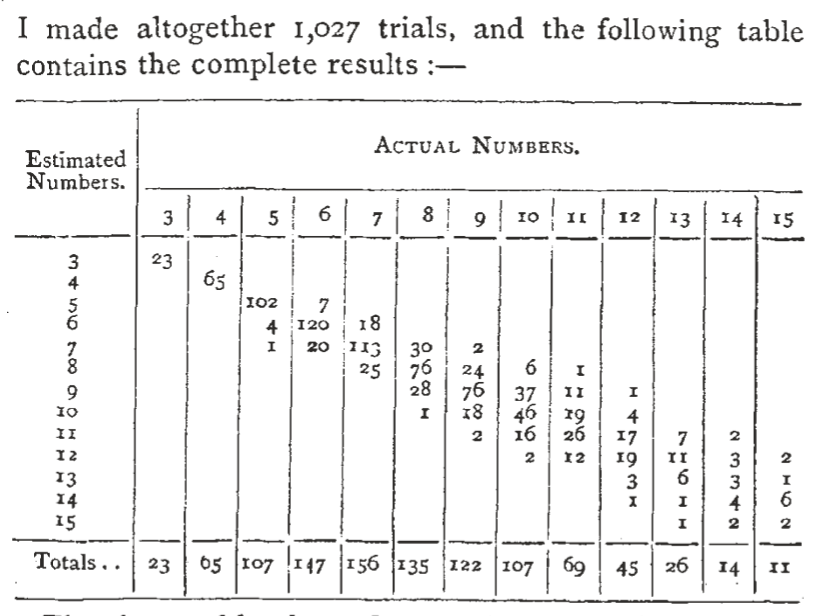

```{r setup, include=F}
knitr::opts_chunk$set(
  echo = FALSE, 
  cache=FALSE, 
  fig.align='center', 
  fig.dim=c(4,2), 
  dev = 'pdf'
  )

library(tidyverse)
library(brms)
library(tidybayes)
library(modelr)
library(patchwork)

source("../helpers.R")
# bikes <- read_csv("../data/bikes.csv")

theme_set(theme_bw(base_size=10) + theme(panel.grid=element_blank()))
update_geom_defaults("point", list(shape = 1, size=1))

n_cores <- parallel::detectCores()
```


# Logistic regression

## The power of numerical discrimination

- Jevons (1871) took a handful of black beans and tossed them at a white shallow container surrounded by black cloth
- On each toss, a certain number of beans would land in the square and he would then look and try to immediately call out their number
- Then he counted how many beans there actually were in the container, and recorded the result.

```{r jevons-results-img, out.height="45%", fig.align='center', fig.cap="Jevons (1871) results from his bean-tossing experiment."}

```

## Jevons (1871) data

```{r, echo=F}
jevons <- tribble(
  ~true_beans, ~correct, ~incorrect,
  3, 23, 0,
  4, 65, 0,
  5, 102, 5,
  6, 120, 27,
  7, 113, 43,
  8, 76, 59,
  9, 76, 46,
  10, 46, 61,
  11, 26, 43,
  12, 19, 26,
  13, 6, 20,
  14, 4, 10,
  15, 0, 11
)
```


```{r}
set.seed(123)
jevons_expanded <- jevons %>% 
  mutate(
    outcomes = map2(correct, incorrect, ~c(rep(1, times = .x), rep(0, times= .y) ))
  ) %>% 
  select(-correct, -incorrect) %>% 
  unnest(outcomes) %>% 
  rename(correct = outcomes) %>% 
  sample_n(1027) # to shuffle order
```

:::::::::::::: {.columns}
::: {.column}

\small
```{r, echo=T}
jevons
```

:::
::: {.column}
\small
```{r, echo=T}
jevons_expanded
```

:::
::::::::::::::

## Generalized linear model: Link functions

The basic schema of a generalized linear model is:

\begin{align*}
  y_i &\stackrel{iid}{\sim} Distribution(z_i, \ldots) \\
  f(z_i) &= \alpha + \beta x_i
\end{align*}

In simple linear regression, $f$ is the identity function: $f(x) = x$

## Logistic regression model

\begin{align*}
  y_i &\sim Bernoulli(p_i) \\
  \text{logit}(p_i) &= \alpha + \beta x_i \\
  \alpha &\sim Normal(0, 1.5) \\
  \beta &\sim Normal(0, .5)
\end{align*}

## Logistic regression and the logit link

The logistic function is the inverse of the logit function (also written $logit^{-1}$)

\begin{align*}
  \text{logit}(p_i)) &= \alpha + \beta x_i \\
  \Rightarrow p_i &= \text{logistic}(\alpha + \beta x_i)
\end{align*}

In `R`:

- `qlogis()` is the logit function
- `plogis()` is the logistic function

## Plotting the logistic function

- The logistic function "squashes" values to between 0 and 1

- It does it in a nice way, so that parameters are in units of log-odds

```{r}
tibble(
  x = seq(-6,6,.01),
  y = plogis(x)
) %>% 
  ggplot(aes(x=x, y=y)) +
  geom_line() +
  labs(y = "logistic(x)")
```

## Odds and log odds

$$O(p) = \frac{p}{1-p}$$

### Some handy equalities

- $O(.50) = 1$
- $O(0) = -\infty$ and $O(1) = \infty$
- $log(1) = 0$

::: notes
- we will have some exercises on this
:::

## Priors on log-odds scale

Things can be ugly! The flat prior implicitly assumed by maximum-likelihood estimation is no good.

$$\alpha \sim Normal(0, 100)$$
```{r}
samples_logodds <- tibble(alpha = rnorm(100000, 0, 100))
samples_prob <- tibble(p = plogis(rnorm(100000, 0, 100)))
ggplot(samples_logodds, aes(alpha)) +
  geom_density() +
  labs(x=expression(alpha)) +
ggplot(samples_prob, aes(p)) +
  geom_density()
```

## Generic priors on log-odds scale

One reasonable rule of thumb is:

$$ \alpha \sim Normal(0, 1.5)$$
$$\beta_k \sim Normal(0,\ .5) \qquad \text{to} \qquad \beta_k \sim Normal(0,\ .1)$$

```{r, warning=F}
samples_logodds <- tibble(alpha = rnorm(100000, 0, 1.5))
samples_logodds2 <- tibble(alpha = rnorm(100000, 0, .5))
samples_prob <- tibble(p = plogis(rnorm(100000, 0, 1.5)))
samples_prob2 <- tibble(p = plogis(rnorm(1e5, 0, 1.5) + rnorm(1e5, 0, .5)))

ggplot(samples_logodds, aes(alpha)) +
  geom_density() +
  labs(x=expression(alpha)) +
  xlim(-6,6) +
ggplot(samples_logodds2, aes(alpha)) +
  geom_density() +
  labs(x=expression(beta)) +
  xlim(-6,6) +
ggplot(samples_prob, aes(p)) +
  geom_density() +
  labs(x=expression(paste("logistic(", alpha, ")"))) + 
ggplot(samples_prob2, aes(p)) +
  geom_density() +
  labs(x=expression(paste("logistic(", alpha + beta, ")")))
```

## Logistic regression model with Bernoulli likelihood

\begin{align*}
y_i &\sim Bernoulli(p_i) \\
\text{logit}(p_i) &= \alpha + \beta x_i \\
\alpha &\sim Normal(0, 1.5) \\
\beta &\sim Normal(0, .1)
\end{align*}

\small

```r
fit_bern <- brm(
  correct ~ true_beans,
  family = bernoulli(),
  prior = prior(normal(0, 1.5), class="Intercept") +
    prior(normal(0, .1), class="b"),
  data = jevons_expanded
  )
```

```{r, echo=F, message=F, results='hide'}
fit_bern <- brm(
  correct ~ true_beans,
  family = bernoulli(),
  prior = prior(normal(0, 1.5), class="Intercept") +
    prior(normal(0, .1), class="b"),
  data = jevons_expanded,
  save_pars = save_pars(all = TRUE),
  file = "_cache/fit_bern",
  file_refit = "on_change"
)
```

## Binomial logistic regression model

- We can also write our logistic regression as a Binomial regression

\begin{align*}
y_i &\sim Binomial(p_i, n_i) \\
\text{logit}(p_i) &= \alpha + \beta x_i \\
\alpha &\sim Normal(0, 1.5) \\
\beta &\sim Normal(0, .1)
\end{align*}

In BRMS we write:

\scriptsize
```r
fit_binom <- brm(
  correct | trials(correct + incorrect) ~ true_beans,
  family = binomial(),
  prior = prior(normal(0,1.5), class="Intercept") +
    prior(normal(0, .1), class="b"),
  data = jevons
  )
```

```{r, echo=F, message=F, resuls='hide'}
fit_binom <- brm(
  correct | trials(correct + incorrect) ~ true_beans,
  family = binomial(),
  prior = prior(normal(0,1.5), class="Intercept") +
    prior(normal(0, .1), class="b"),
  data = jevons,
  save_pars = save_pars(all = TRUE),
  file = "_cache/fit_binom",
  file_refit = "on_change"
)
```

::: notes
- When we first analyzed the Jevons' data in module 1, we used the Beta-Binomial model
- generally only makes sense to write it this way when the predictors take on a limited number of values
- will get the same parameter estimates
- but predicting etc. will work a bit differently
:::


## Bernoulli vs Binomial logistic regression

- These two models are equivalent and produce the same parameter estimates
- But the models function differently for __prediction__
- Binomial version can be helpful when all predictors are discrete


## (Expected) posterior predictive

:::::::::::::: {.columns}
::: {.column}

### Posterior predictive

- `add_predicted_draws()` will add samples from the posterior predictive
- __Bernoulli:__ will be __1 or 0__ for success or failure
- __Binomial:__ will be a __count__ of successes (out of $n$ trials)

:::
::: {.column}


### Expected posterior predictive

- `add_epred_draws()` will add samples from the expected posterior predictive
- __Bernoulli:__ will be probability for success or failure
- __Binomial:__ will be an expected __count__ of successes (out of $n$ trials)

:::
::::::::::::::


## Posterior prediction from Bernoulli and Binomial

:::::::::::::: {.columns}
::: {.column}

\tiny
```{r, echo=T, warning=F}
jevons_expanded %>%
  add_predicted_draws(fit_bern,  ndraws=5) %>% 
  select(-.chain, -.iteration, -.row)
```

:::
::: {.column}

\tiny
```{r, echo=T, warning=F}
jevons %>%
  add_predicted_draws(fit_binom,  ndraws=5) %>% 
  select(-.chain, -.iteration, -.row)
```
:::
::::::::::::::

## Skipping the link function: `add_linpred_draws()`

- Now that we have begun to use link functions, it can sometimes be useful to sample from the posterior predictive distribution of the linear model without the link function applied.
- We can then apply the link function afterwards, if we want.
- `add_linpred_draws()` from the `tidybayes` package will accomplish this.

## Using `add_linpred_draws()`

Example: you could use this to predict the probability from a Binomial logistic regression with `add_linpred_draws()` and `plogis()` (the logistic function).

\scriptsize
```{r, echo=T, warning=F}
jevons %>%
  add_linpred_draws(fit_binom,  ndraws=5) %>% 
  mutate(.pred_prob = plogis(.linpred)) %>% 
  select(-.chain, -.iteration, -.row)
```


## From expected posterior predictive to posterior predictive

In logistic regression, the linear model is used to predict the probability of success for each of the $i$ observations, $p_i$.

$$ \text{Posterior } p_i = P(p_i|y)$$

### Posterior predictive distributions

\begin{align*}
  y_i^* &\sim Bernoulli(p_i|y) \\
  y_i^* &\sim Binomial(p_i|y,\ n_i) 
\end{align*}

### Expected posterior predictive distributions

\begin{align*}
  E(P(y^*_i)) \qquad
  E(X_{Bern}) = p \qquad
  E(X_{Binom}) = Np
\end{align*}

## Coding posterior predictive distributions

\scriptsize

```{r, echo=T, warning=F, message=F}
jevons_expanded %>%
  group_by(true_beans) %>% 
  mutate(trials = n(), n_correct = sum(if_else(correct == 1, 1,0))) %>% 
  add_epred_draws(fit_bern,  ndraws = 3) %>% 
  mutate(
    .predbern = rbernoulli(n(), .epred),
    .predbinom = rbinom(n(), trials, .epred)
  ) %>% select(-.chain, -.iteration)
```

## Posterior predictive density checks: Bernoulli

```{r, message=F, echo=T}
pp_check(fit_bern, type="hist", ndraws=11)
```

## Posterior predictive density checks: Binomial

```{r, warning=F, message=F, echo=T}
pp_check(fit_binom, type="hist", ndraws = 11)
```

## Posterior predictive plot

```{r, warning=F, message=F}
jevons %>%
  mutate(trials = correct+incorrect) %>%
  add_predicted_draws(fit_binom,  ndraws=1000) %>% # comes out grouped by .row
  summarize(
    .pred = mean(.prediction)/trials,
    .lower = quantile(.prediction, .025)/trials,
    .upper = quantile(.prediction, .975)/trials
    ) %>%
  ggplot(aes(x=true_beans)) +
  geom_point(aes(y = correct/trials)) +
  geom_line(aes(y = .pred)) +
  geom_ribbon(aes(ymin = .lower, ymax = .upper), alpha=1/4) 

```

## Psychological model(s)

- Hypothesis is that there is a certain "power of numerical discrimination" where you have ~100% accuracy
- Nowadays, we know this power comes from the human visual system's multi-object tracking system, which can track a limited number of objects simultaneously
- How many items can Jevon's visual system process simultaneously?

```{r}
## maybe a theoretical diagram
```

## Comparing different thresholds

One way to determine the most likely limit for Jevon's powers is to create models with different thresholds and compare how well they account for his data.

```{r}
## maybe figure to illustrate this?
```

## Possible thresholds at 3, 4, 5, and 6

I created indicator variables `underT` and `overT` for thresholds at 3, 4, 5, and 6. 

\small
```{r, echo=T}
df1 <- jevons %>% 
  mutate(
    under3 = if_else(true_beans <= 3, 1, 0),
    under4 = if_else(true_beans <= 4, 1, 0),
    under5 = if_else(true_beans <= 5, 1, 0),
    under6 = if_else(true_beans <= 6, 1, 0),
    over3 = if_else(true_beans > 3, 1, 0),
    over4 = if_else(true_beans > 4, 1, 0),
    over5 = if_else(true_beans > 5, 1, 0),
    over6 = if_else(true_beans > 6, 1, 0),
    beans_over3 = if_else(true_beans <= 3, 0, true_beans - 3),
    beans_over4 = if_else(true_beans <= 4, 0, true_beans - 4),
    beans_over5 = if_else(true_beans <= 5, 0, true_beans - 5),
    beans_over6 = if_else(true_beans <= 6, 0, true_beans - 6),
    )
```

## A thresholded model

\begin{align*}
y_i &\sim Binomial(p_i, n) \\
p_i &= \text{logit}^{-1}( \beta_1 \text{under}_i + \beta_2 \text{over}_i + \beta_3 \text{over}_i \colon \text{true\_beans}_i ) \\
\beta_1 &\sim Normal(3, 1.5) \\
\beta_2 &\sim Normal(0, 1.5) \\
\beta_3 &\sim Normal(0, .1)
\end{align*}

- The idea is there is a threshold number of items under which performance is unaffected by the number and is essentially perfect

- Beyond the threshold, performance can start to decline as the number of items increases

## Implementing the models in `brms`

- Then, I fit four separate models using these predictors
- Below is an example for a model with a threshold of 3 objects

\scriptsize
```{r, echo=T, message=F, results='hide'}
fit_t3 <- brm(
  correct | trials(correct + incorrect) ~ 0 + under3 + over3 + beans_over3,
  family = binomial(),
  prior = prior(normal(0, 1.5), coef="over3") +
    prior(normal(0, 1.5), coef = "under3") +
    prior(normal(0, .1), coef="beans_over3"),
  data = df1,
  save_pars = save_pars(all = TRUE),
  file = "_cache/fit_t3",
  file_refit = "on_change"
)
```

```{r, message=F, results='hide'}
fit_t4 <- brm(
  correct | trials(correct + incorrect) ~ 0 + under4 + over4 + beans_over4,
  family = binomial(),
  prior = prior(normal(0, 1.5), coef="over4") +
    prior(normal(0, 1.5), coef = "under4") +
    # prior(constant(7), coef = "under4") + 
    prior(normal(0, .1), coef="beans_over4"),
  data = df1,
  save_pars = save_pars(all = TRUE),
  file = "_cache/fit_t4",
  file_refit = "on_change"
)

fit_t5 <- brm(
  correct | trials(correct + incorrect) ~ 0 + under5 + over5 + beans_over5,
  family = binomial(),
  prior = prior(normal(0, 1.5), coef="over5") +
    prior(normal(0, 1.5), coef = "under5") +
    # prior(constant(7), coef = "under5") + 
    prior(normal(0, .1), coef="beans_over5"),
  data = df1,
  save_pars = save_pars(all = TRUE),
  file = "_cache/fit_t5",
  file_refit = "on_change"
)

fit_t6 <- brm(
  correct | trials(correct + incorrect) ~ 0 + under6 + over6 + beans_over6,
  family = binomial(),
  prior = prior(normal(0, 1.5), coef="over6") +
    prior(normal(0, 1.5), coef = "under6") +
    # prior(constant(7), coef = "under6") + 
    prior(normal(0, .1), coef="beans_over6"),
  data = df1,
  save_pars = save_pars(all = TRUE),
  file = "_cache/fit_t6",
  file_refit = "on_change"
)
```

## Posterior predictions for the threshold models

```{r}
jevons_post_pred <- function(fit, model_name){
  
  df1 %>% 
  mutate(trials = correct+incorrect) %>%
  add_predicted_draws(fit) %>% # comes out grouped by .row
  summarize(
    .pred = mean(.prediction)/trials,
    .lower = quantile(.prediction, .025)/trials,
    .upper = quantile(.prediction, .975)/trials
    ) %>% 
    mutate(model_name = model_name)
}

plot_jevons_pred <- function(pred_df){
  pred_df %>%
  ggplot(aes(x=true_beans)) +
  geom_point(aes(y=correct/trials), alpha=.75) +
  geom_line(aes(y=.pred)) +
  geom_ribbon(aes(ymin=.lower, ymax=.upper), alpha=1/4)
}
```

```{r, message=F, fig.dim=c(4,2.5)}
model_list <- list(
  threshold_3 = fit_t3, 
  threshold_4 = fit_t4, 
  threshold_5 = fit_t5, 
  threshold_6 = fit_t6
  )
jevons_preds <- map2_df(model_list, names(model_list), jevons_post_pred)
plot_jevons_pred(jevons_preds) + facet_wrap(~model_name)  
```

## Model comparison

\small
```{r, echo=T, message=F, warning=F}
comp1 <- loo(fit_binom, fit_t3, fit_t4, fit_t5, fit_t6,
  moment_match = T
)
comp1$diffs
```


::: notes
- `moment_match = T` uses a fancier but slower method that produces more accurate results. 
- if needed, `loo()` will warn you. So just listen to `loo()`
:::

## Model averaging

- If we can't pick one best model, we can use them all together

- Bayesian model averaging combines predictions from multiple models

- Models are weighted by the $\text{elppd}_\text{loo}$ to optimize for out-of-sample predictive accuracy

## Model weights

Roughly: The weights tell us how much we should listen to each model if we want to make the best out-of-sample predictions.

```{r, echo=T, warning=F}
loo_model_weights(comp1$loos, method="pseudobma")
```

::: notes
- The weights computed for each model can tell us how plausible each model is. 

There is no one best model, but we can see from the model "pseudo-BMA" weights that the threshold=4 and threshold=5 make the best predictions, and the other models should essentially be ignored. So altogether we can affirm that the change-point is most likely at either 4 or 5 objects to be counted.

- A valuable lesson: sometimes the data just isn't there to answer a question with tons of confidence, and all the fancy statistics in the world can't change that.
:::

# Poisson regression example

## NYPD's stop-and-frisk program

- Controversial (read: bad) NYPD practice of temporarily detaining, questioning, and at times searching civilians and suspects on the street for weapons and other contraband.

- Started under Mayor Rudy Giuliani, continued under Mayor Michael Bloomberg, and finally reformed by Mayor Bill De Blasio

- At its height in 2011, NYPD officers recorded conducting 685,724 stops with 88% (603,437) resulting in no conviction.

::: notes
685000/8129000 = enough to have stopped 8.4% of nyc population

- Reformed but not stopped---still going on in several precincts according to recent Intercept article.

- A review of the NYPD’s stops-related data shows that in 2020, the number of reported stops was at its lowest ever — 9,544, down from 13,459 in 2019 and 11,008 in 2018. Despite the drop, the racial disparity remained as stark as ever, with New Yorkers of color making up 91 percent of those stopped, roughly the same as in the two years prior.

https://theintercept.com/2021/06/10/stop-and-frisk-new-york-police-racial-disparity/
:::

```{r, message=F}
nypd <- read_csv("../data/frisk_with_noise.csv") %>% 
  mutate(precinct = factor(precinct))

# df2 <- nypd %>% 
#   mutate(precinct = factor(precinct)) %>% 
#   group_by(ethnicity, precinct, pop) %>% 
#   summarize(stops = sum(stops), arrests = sum(arrests)) %>% 
#   mutate(arrest_rate = arrests/pop)

df2 <- nypd %>% 
  filter(crime_type %in% c("drug")) %>% 
  filter( !(precinct %in% c(3, 8, 23, 61)) ) %>% 
  mutate(arrest_rate = arrests/pop) %>% 
    mutate(
    precinct = factor(precinct)
    )
```

## Racial bias in NYPD's stop and frisk program

> In total, blacks and Hispanics represented 51% and 33% of the stops, despite being only 26% and 24%, of the city population based on the 1990 Census ... --- Gelman, Fagan, & Kiss, 2007 (using data from 1998-1999)

- A judge ruled in 2013 that New York City’s stop-and-frisk program was carried out in a manner that violated the U.S. Constitution

- A number of studies have found no evidence that stop-and-frisk reduced crime

## Stop and frisk data

We will examine a dataset of NYPD stops from a 15mo time period from 1998-1999.

```{r}
nypd
```

::: notes
the data has the 

- number of stops
- total population 
- arrests in the prior year
- per precinct (75 precincts)
- per suspected crime type
- for three ethnic groups: black, hispanic, and white (nypd also recorded "other", but only rarely)
:::

## Drug stops by ethnicity

```{r, fig.dim=c(4,2.5)}
df2 %>% 
  ggplot(aes(x=stops/pop)) +
  geom_histogram(binwidth=.001) +
  facet_wrap(~ethnicity, ncol=1)
```

::: notes
- can think it's bad from a 4th amendment perspective
- but is there a racial bias to the stops (at least in terms of outcomes)?
- looks likely
:::

## Dummy-coding factor variables

| ethnicity | d1 | d2 |
|-----------|:--:|:--:|
| black     |  0 |  0 |
| hispanic  |  1 |  0 |
| white     |  0 |  1 |

- For $n$ categories, create $n-1$ binary dummy variables
- One level is the "reference" level with all zeros on the dummy variables
- `brm()` will make these variables for us automatically if we pass a factor variable into our equation (as will `lm()` and `glm()`).

## A Normal model

What happens if we use a normal model on the counts?

\small
```r 
fit2_normal <- brm(stops/pop ~ ethnicity, data = df2)
```
```{r, echo=F, message=F, results='hide'}
fit2_normal <- brm(
  stops/pop ~ ethnicity, 
  data = df2, 
  family = gaussian(),
  file = "_cache/fit2_normal",
  file_refit = "on_change"
  )
```

```{r, echo=T, message=F}
pp_check(fit2_normal, type="dens_overlay", bw="SJ", adjust=1)
```

::: notes
posterior predictive density checks look very bad.
:::

## The Poisson distribution as a model for counts

- The Poisson distribution describes the probability of counts when the total number of "trials" is unknown or uncountable.

- Described by just one parameter, $\lambda$

$$y_i \sim Poisson(\lambda_i)$$


::: notes
Like the Binomial distribution, but where we don't know the number of possible trials (or there is no maximum number of trials)
:::


## Log-link function

\begin{align*}
y_i &\sim Poisson(\lambda_i) \\
\text{log}(\lambda_i) &= \alpha + \beta x_i
\end{align*}

- $\lambda_i$ must be a positive number

- We use the $\text{log}$ link function to ensure this.

- A log link makes the regression coefficients __multiplicative__

  - $\text{log}(X) + \text{log}(Y) = \text{log}(XY)$ and $\text{log}(X) - \text{log}(Y) = \text{log}(X/Y)$
  
  - $\text{exp}\big(\text{log}(X) + \text{log}(Y)\big) = XY$
  
- $exp(\beta)$ tells us: by how many times the rate $\lambda$ increases with a one-unit increase in $x$

::: notes
- log(0) = -Inf
- log(1) = 0
- log( < 1) = negative
- log( > 1) = positive
:::

## Poisson distribution as model for rates

- Poisson is a __discrete__ probability distribution for integer counts

- But can also be used to model __rates__ by including an _offset_ or _exposure_ predictor

- E.g. can model events per month, per population size, etc.

$$\text{log}(\lambda/\tau) = \text{log}(\lambda) - \text{log}(\tau)$$

::: notes
- 
:::

## Our first Poisson regression model

\begin{align*}
y_i &\sim Poisson(\lambda_i) \\
\text{log}(\lambda_i) &= \alpha + \beta_1 E^w_i + \beta_2 E^h_i - log(\tau) \\
\tau & = population \\
\alpha &\sim Normal(0, 5) \\
\beta_1 &\sim Normal(0, .5) \\
\beta_2 &\sim Normal(0, .5) 
\end{align*}

## Implementing the Poisson regression model

\small

```{r, message=F, results='hide', echo=T}
fit2 <- brm(
  stops ~ ethnicity + offset(log(pop)),
  prior = prior(normal(0, 5), class="Intercept") + 
    prior(normal(0, .5), class="b"),
  data = df2,
  family = poisson(),
  iter = 4000,
  save_pars = save_pars(all = TRUE),
  file = "_cache/fit2",
  file_refit = "on_change"
)
```

## Posterior predictive distribution check

```{r, echo=T, message=F}
pp_check(fit2, type="dens_overlay")
```

::: notes
- Poisson is discrete, but when counts are large can be ok to visualize with a density
:::

## Interpreting coefficients

\scriptsize
```{r}
summary(fit2)
```

::: notes
- $exp(\beta)$ is relative rate
- exp(-1.56) = .210 
- black people are stopped 4.75 as many times a white people (exp(1.56))
::: 

## Compared to normal model estimates

- Poisson coefficients are multiplicative
- We can multiply/divide coefficients from the normal model to compare

### Normal model estimates

\scriptsize
```{r, warning=F}
posterior_samples(fit2_normal) %>% 
  mutate(
    ethnicitywhite = b_Intercept / (b_Intercept + b_ethnicitywhite) ,
    ethnicityhispanic = b_Intercept / (b_Intercept + b_ethnicityhispanic)
    ) %>% 
  select(starts_with("ethnicity")) %>% 
  gather(Coefficient, relative_prob) %>% 
  group_by(Coefficient) %>% 
  summarize(
    Estimate = median(relative_prob),
    Q2.5 = quantile(relative_prob, .025),
    Q97.5 = quantile(relative_prob, .975),
  )

```

### Poisson model estimates

\scriptsize
```{r, warning=F}
fixef(fit2, robust=T) %>% 
  as_tibble(rownames="Coefficient") %>% 
  filter(Coefficient!="Intercept") %>% 
  mutate_if(is.numeric, ~exp(-.x)) %>% 
  rename(.upper = Q2.5, .lower = Q97.5) %>% 
  select(
    Coefficient, Estimate, .lower, .upper
  )
```


::: notes

- Using robust estimates (medians) in both cases b/c normal came out very wild

- normal model gives biased estimate for hispanic stop-rate, and has huge amounts of uncertainty
:::

## Posterior prediction

```{r, echo=T, message=F}
## pp_check_coverage(data, model, dependent variable)
pp_check_coverage(df2, fit2, stops)
```

```{r, message=F, warning=F}

df2 %>%
  add_predicted_draws(fit2) %>%
    mutate(.prediction = .prediction/pop) %>%
    summarize(
      .pred = mean(.prediction),
      .lower = quantile(.prediction, .025),
      .upper = quantile(.prediction, .975)
    ) %>%
  ggplot(aes(x=reorder(precinct, stops/pop))) +
  # geom_line(aes(y=.pred, color=ethnicity)) +
  geom_errorbar(aes(ymin=.lower, ymax=.upper, color=ethnicity), size=1.5, alpha=.25, width=0) +
  geom_point(aes(y = stops/pop, color=ethnicity)) + 
  facet_wrap(~ethnicity, ncol=3, scales="free_x") + 
  ylim(0,.03) +
  labs(x="Precinct", y = "stop rate\n(observed and prediction intervals)") +
  theme_bw(base_size = 8) +
  theme( panel.grid = element_blank(),
    axis.text.x = element_text(size=3,angle=90), legend.position="none")
```

::: notes
I wrote a little function called `pp_check_coverage()` to compute what proportion of the observations fell within the 95% prediction intervals
:::

## Overdispersion

- Under Poisson distribution both the variance and mean are equal to $\lambda$

- But often we observe with count data that the variance is larger than the mean

- This is called ___overdispersion___

## Dealing with overdispersion

### Negative-Binomial or Gamma-Poisson model

- One way to deal with overdispersion is to replace the Poisson distribution with the Negative-Binomial (aka Gamma-Poisson) distribution.

$$y_i \sim Negative\text{-}Binomial(\lambda_i, \phi)$$
$$\text{Var}(X_{NB}) =  \lambda - \frac{\lambda^2}{\phi}$$

### Improve the model

- Another way is to address overdispersion is to account for structure of data better

::: notes
- In the normal model, if we get $\mu$ wrong, then we will get a larger estimate for $\sigma$. So we will make imperfect predictions but also have appropriate uncertainty in them.
- But in Poisson we just have $\lambda$ so model misspecification will result in overconfidence
:::

## Adding a predictor

If different police precincts have different leaders and policies, then they could each have their own baseline rate of stops

- Let's add predictors to code for precinct
- There are 75 precincts, so we need 74 dummy-coded predictors
- `brm()` will make these for us if we pass a factor variable into our equation (as will `lm()` and `glm()`).

\small
```{r, message=F, results='hide', echo=T}
fit3 <- brm(
  stops ~ ethnicity + precinct + offset(log(pop)),
  prior = prior(normal(0, 5), class="Intercept") + 
    prior(normal(0, .5), class="b"),
  data = df2,
  family = poisson(),
  iter = 8000,
  save_pars = save_pars(all = TRUE),
  file = "_cache/fit3",
  file_refit = "on_change"
)
```

## Adding 74 predictors???

- Normally we would be pretty hesitant to add 74 predictor variables to a model predicitng 225 rows of data

- But with count data, the effective sample size is not purely determined by the number of rows

- The counts themselves also influence the effective sample size, larger counts will allow for more precise parameter estimates

::: notes
- we haven't really talked about "power" because it's an NHST thing
- but here I mean the precision of our estimates
:::

## Posterior predictive `fit3`

```{r, echo=T, message=F}
pp_check_coverage(df2, fit3, stops)
```

```{r, warning=F, message=F, fig.dim=c(4,2.5)}
df2 %>%
  add_predicted_draws(fit3) %>%
    mutate(.prediction = .prediction/pop) %>%
    summarize(
      .pred = mean(.prediction),
      .lower = quantile(.prediction, .025),
      .upper = quantile(.prediction, .975)
    ) %>%
  ggplot(aes(x=reorder(precinct, stops/pop))) +
  # geom_line(aes(y=.pred, color=ethnicity)) +
  geom_errorbar(aes(ymin=.lower, ymax=.upper, color=ethnicity), size=.9, alpha=.25, width=0) +
  geom_point(aes(y = stops/pop, color=ethnicity)) + 
  facet_wrap(~ethnicity, ncol=3, scales="free_x") + 
  ylim(0,.03) +
  labs(x="Precinct", y = "stop rate\n(observed and prediction intervals)") +
  theme_bw(base_size = 8) +
  theme( panel.grid = element_blank(),
    axis.text.x = element_text(size=3,angle=90), legend.position="none")
```

## Bias?

> One newspaper and one news service, they just keep saying ‘oh it’s a disproportionate percentage of a particular ethnic group.’ That may be, but it’s not a disproportionate percentage of those who witnesses and victims describe as committing the [crime]. In that case, incidentally, I think we disproportionately stop whites too much and minorities too little. ---Bloomberg, 2013

Or so-claimed NYPD Mayor Michael Bloomberg in 2013.

Are the different stop-rates a result of bias? Or could they simply reflect differences in the crime rates among people from different groups?

## "Controlling for" arrest rates

- Let's try to address this objection by statistically controlling for the crime rate among New Yorkers of different ethnicities within each precint's jurisdiction.

- As a proxy for the true crime rate, we will use the arrest rates for different groups (following Gelman, Fagan, & Kiss, 2007) . 

- This analysis will be extremely charitable to the NYPD as it will assume there is no bias in arrest rates and that any differences in the arrests reflect differences in the true crime rate among the different ethnic groups (possibly owing to other factors like poverty, education, etc.)

- If we control for arrest counts, do we still see bias in the stops?

::: notes


- this may help our model's issues as well, if the predictor improves our fit

- later we will expand on this idea of "controlling for" and give things a more rigorous causal treatment

- for now, since the assumption is essentially imaginary, we will just proceed in thinking about this in the statistical sense

[Control for arrests by adding as predictor, note that it improves fit quite a bit (what does that mean? makes stops look less biased. but clear they are still biased.)]

[arrests might be biased (it's sort of obvious that they are.) And it wouldn't be surprising if they were less biased than stops. b/c need SOMETHING to arrest, but nothing to stop]
:::

## Adding a predictor for arrest rates

\small
```{r, message=F, results='hide', echo=T}
fit4 <- brm(
  stops ~ ethnicity + precinct + log(arrest_rate) + offset(log(pop)),
  prior = prior(normal(0, 5), class="Intercept") + 
    prior(normal(0, .5), class="b"),
  data = df2,
  family = poisson(),
  iter = 8000,
  save_pars = save_pars(all = TRUE),
  file = "_cache/fit4",
  file_refit = "on_change"
)
```

## Posterior predictive check `fit4`

\small
```{r, echo=T, message=F}
pp_check_coverage(df2, fit4, stops)
```

```{r, message=F, warning=F, fig.dim=c(4, 2.25)}
df2 %>%
  add_predicted_draws(fit4) %>%
    mutate(.prediction = .prediction/pop) %>%
    summarize(
      .pred = mean(.prediction),
      .lower = quantile(.prediction, .025),
      .upper = quantile(.prediction, .975)
    ) %>%
  ggplot(aes(x=reorder(precinct,.pred))) +
  # geom_line(aes(y=.pred, color=ethnicity)) +
  geom_errorbar(aes(ymin=.lower, ymax=.upper, color=ethnicity), size=.9, alpha=.25, width=0) +
  geom_point(aes(y = stops/pop, color=ethnicity)) + 
  facet_wrap(~ethnicity, ncol=3, scales="free_x") + 
  ylim(0,.03) +
  labs(x="Precinct", y = "stop rate\n(observed and prediction intervals)") +
  theme_bw(base_size = 8) +
  theme( panel.grid = element_blank(),
    axis.text.x = element_text(size=3,angle=90), legend.position="none")
```

::: notes

Still looks like our data are overdispersed, but predictions are considerably more accurate.

- Would need to either get more clever or change likelihood to Negative-Binomial
- Will leave that for another day
- plot omits one extreme outlier to make it easier to see others
:::

## Inspecting the parameters

\small
```r
fixef(fit4) %>% 
  ...
```

```{r}
fixef(fit4) %>% 
  as_tibble(rownames="Coefficient") %>% 
  arrange(grepl("precinct", Coefficient)) %>% 
  trunc_mat() 
```

::: notes
- I call `fixef()` and do some munging to clean up the output
- exp(-.675) = `r round(exp(-.675),4)` or black people are stopped `r round(exp(.675),4)` as many times a white people
:::

## Model comparison

```{r, echo=T, warning=F, cache=TRUE}
comps2 <- loo(fit2, fit3, fit4)
comps2$diffs
```

## How should we interpret this?

Should we think these latest estimates are the true ones?

- Assumed arrest-rate reflects true crime rate
- But that's not very likely to be true, especially now that we see the bias in stops persists
- Arrests must be recorded, but can we trust all stops were recorded?
- Remember: statistics is just a tool for understanding, not a replacement for thinking
