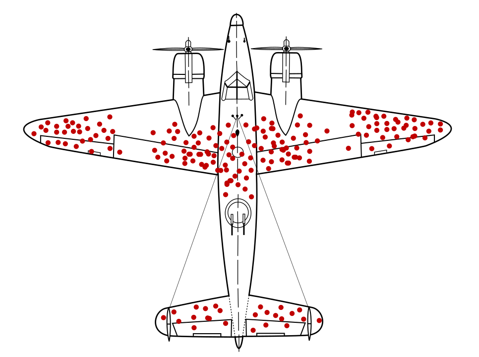

```{r setup, include=F}
knitr::opts_chunk$set(
  echo = FALSE, 
  cache = TRUE, 
  fig.align='center', 
  fig.dim=c(4,2), 
  dev = 'pdf'
  )

library(tidyverse)
library(brms)
library(tidybayes)
library(modelr)
library(patchwork)
library(dagitty)
source("../helpers.R")
# bikes <- read_csv("../data/bikes.csv")

theme_set(theme_bw(base_size = 10) + theme(panel.grid = element_blank()))
update_geom_defaults("point", list(shape = 1, size=1))

n_cores <- parallel::detectCores()

drawdag <- rethinking::drawdag
```

# Failing to condition

## Confounding: Spurious association

::: notes
got to slide 33 in last lecture
:::

A confounder (C) causes both X and Y, leading X and Y to be associated but not causally related.

```{r, fig.dim=c(2,1)}
dag_spurious <- dagitty('dag {
    X [pos="0,1"]
    C [pos=".5,0"]
    Y [pos="1,1"]
    
    C -> X
    C -> Y
}')

drawdag(dag_spurious)
```

## Simulating spurious association

\small

```{r}
set.seed(123)
```

```{r, echo =T}
N <- 1000
d1 <- tibble(
  C = rnorm(N),
  X = .5*C + rnorm(N),
  Y = .5*C + rnorm(N)
)
```

```{r, message=F}
(qplot(d1$C, d1$X, geom="point") +
  labs(x = "C", y="X") +
   geom_smooth(method="lm") +
  qplot(d1$C, d1$Y, geom="point") +
  labs(x = "C", y = "Y") +
   
   geom_smooth(method="lm") +
  qplot(d1$X, d1$Y, geom="point") + 
  labs(x = "X", y="Y") +
   geom_smooth(method="lm") 
 ) * theme(aspect.ratio=1) 
```

## Regressions can de-confound

\small
```{r, echo=T}
coef(lm(Y ~ X, data = d1))
coef(lm(Y ~ C + X, data = d1))
```

## Confounding (masked relationship)

- Confounding can also mask relationships, making them appear weaker than they are

- Causal explanation of so-called "suppressor" variables in multiple regression

## Primate milk

- Milk is a costly physiological investment for mammals

- Brains are also a costly physiological investment

- A popular hypothesis is that primates with larger brains produce more energetic milk to support brain growth.

- Humans are unique in having a larger brain and more developed neocortex than other primates (and mammals)

::: notes

- comparative, evolutionary anthropology

- also unique for how long it takes human infants to develop

- primate milk is relatively dilute, because primate infants suckle frequently and for long periods of growth/development, and humans are a fairly extreme case of this

- https://onlinelibrary.wiley.com/doi/epdf/10.1002/evan.20289
:::

## Milk data

We will focus on 3 variables:

- `mass`: Average body mass of adult female (Kg)
- `neocortex.perc`: Percent of brain mass that is neocortex ("grey matter")
- `kcal.per.g`: Milk energy density (Kcal/g)


\scriptsize
```{r, echo = T}
data("milk", package = "rethinking")
glimpse(milk)
```

## Transforming variables

\scriptsize
```{r, echo=T}
milk <- milk %>% 
  mutate(
    mass = log(mass)
  ) %>% 
  mutate_at(vars(mass,neocortex.perc,kcal.per.g), standardize) %>% 
  drop_na(neocortex.perc)
```

## Associations between variables

```{r, fig.dim=c(4.5,2), message=F}
ggplot(milk, aes(x=neocortex.perc, y = mass)) +
  geom_point() +
  geom_smooth(method="lm") +
  theme(aspect.ratio = 1) +
  
ggplot(milk, aes(x=neocortex.perc, y = kcal.per.g)) +
  geom_point() +
  geom_smooth(method="lm") +
  theme(aspect.ratio = 1) +

ggplot(milk, aes(x=mass, y = kcal.per.g)) +
  geom_point() +
  geom_smooth(method="lm") +
  theme(aspect.ratio = 1)
```

::: notes
- Remember, independence is the strong assumption

- So even though the relationships look weak or uncertain, there could be associations among all these variables, so not clearly independent.
:::

## Some possible DAGs

```{r}
dag1 <- dagitty('dag {
    N [pos="1,0"]
    M [pos="0,0"]
    K [pos=".5,1"]
    
    M -> N -> K
    M -> K
}')

dag2 <- dagitty('dag {
    N [pos="1,0"]
    M [pos="0,0"]
    K [pos=".5,1"]
    
    N -> M -> K
    N -> K
}')


dag3 <- dagitty('dag {
    N [pos="1,0"]
    M [pos="0,0"]
    K [pos=".5,1"]
    U [unobserved pos=".5,0"]
    
    U -> M -> K
    U -> N -> K
}')
```

DAGs showing different relationships between log body mass (M), percentage brain mass of the neocortex (N), and kilo-calories per gram of milk (K).

:::::::::::::: {.columns align=top}
::: {.column width="30%"}

```{r, fig.dim=c(1.5,1.5)}
drawdag(dag1)
```
__1__

:::
::: {.column width="30%"}


```{r, fig.dim=c(1.5,1.5)}
drawdag(dag2)
```
__2__
:::
::: {.column width="30%"}


```{r, fig.dim=c(1.5,1.5)}
drawdag(dag3)
```
__3__
:::
::::::::::::::

## Comparing regressions

```{r, message=F, results='hide'}
fit_neo <- brm(kcal.per.g ~ neocortex.perc, data = milk)
fit_mass <- brm(kcal.per.g ~ mass, data = milk)
fit_mass_neo <- brm(kcal.per.g ~ neocortex.perc + mass, data = milk)
```

__Model 1__: `brm(kcal.per.g ~ mass, data = milk)`
\scriptsize

```{r}
fixef(fit_mass) %>% round(3)
```

\normalsize
__Model 2__: `brm(kcal.per.g ~ neocortex.perc, data = milk)`
\scriptsize

```{r}
fixef(fit_neo) %>% round(3)
```

\normalsize
__Model 3__: `brm(kcal.per.g ~ neocortex.perc + mass, data = milk)`
\scriptsize

```{r}
fixef(fit_mass_neo) %>% round(3)
```

## What is happening?

Regression is asking: 

- do species that have high neocortex percent _for their body mass_ have high milk energy? 

- do species with high body mass _for their neocortex percent_ have higher milk energy?

::: notes
- Body mass is positively correlated with neocortex percentage
- Body mass is negatively correlated with milk energy (Kcal)
- Neocortex percentage is positively correlated with milk energy
:::

# Overadjustment: conditioning too much

## Causal salad

- Some researchers were trained to include as many covariates in a regression model as possible in order to "control for" as much as possible---toss everything into the salad

- But this is wrong!

- Controlling for the wrong covariates can be just as bad as failing to control for the right ones

## Confounds versus additional causes

```{r}
dag_conf <- dagitty('dag {
    X [pos="0,.5"]
    Y [pos="1,.5"]
    Q [pos=".5,0"]
    R [pos=".5,1"]
    
    X -> Y
    Q -> X
    Q -> Y
    R -> X
    R -> Y
}')

dag_unconf <- dagitty('dag {
    X [pos="0,.5"]
    Y [pos="1,.5"]
    Q [pos=".5,0"]
    R [pos=".5,1"]
    
    X -> Y
    Q -> Y
    R -> Y
}')
```

:::::::::::::: {.columns}
::: {.column}


```{r, fig.dim=c(1.5,1.5)}
drawdag(dag_conf)
```

\scriptsize
```{r, echo=T}
d2 <- tibble(
  Q = rnorm(N),
  R = rnorm(N),
  X = .5*R + .7*Q + rnorm(N),
  Y = -.3*R + .6*Q + .5*X + rnorm(N)
)
```


:::
::: {.column}

```{r, fig.dim=c(1.5,1.5)}
drawdag(dag_unconf)
```

\scriptsize
```{r, echo=T}
d3 <- tibble(
  Q = rnorm(N),
  R = rnorm(N),
  X = rnorm(N),
  Y = -.3*R + .6*Q + .5*X + rnorm(N)
)
```

:::
::::::::::::::

## Only need to control for confounds

:::::::::::::: {.columns}
::: {.column}

```{r, fig.dim=c(1.5,1.5)}
drawdag(dag_conf)
```


\tiny
```{r, echo=T, results='hide', message=F}
fit_conf1 <- brm(Y ~ X, data = d2)
fit_conf2 <- brm(Y ~ X + Q + R , data = d2)
```

```{r, echo=T}
fixef(fit_conf1) %>% round(3)
fixef(fit_conf2) %>% round(3)
```

:::
::: {.column}

```{r, fig.dim=c(1.5,1.5)}
drawdag(dag_unconf)
```

\tiny
```{r, echo=T, results='hide', message=F}
fit_unconf1 <- brm(Y ~ X, data = d3)
fit_unconf2 <- brm(Y ~ X + Q + R , data = d3)
```

```{r, echo=T}
fixef(fit_unconf1) %>% round(3)
fixef(fit_unconf2) %>% round(3)
```


:::
::::::::::::::

::: notes
- but including additional causes as covariates does reduce our uncertainty in our estimates
:::

## To control or not to control

- Suppose we are interested in how __race__ (white or non-white) affects __salary__ within a firm. 

- We can improve the fit of our model of salaries by adding covariates: 
   - Each employee's __productivity__
   - Each employee's __position__ within the company (manager and non-manager). 

- Should we control for these factors to estimate the causal effect of race on salary?

## Controlling for mediators (post-treatment variables)

If we control for position we will remove part of the causal effect of race that we wanted to measure.

```{r}
dag_pt <- dagitty('dag {
    Race [pos="0,.5"]
    Salary [pos="1,.5"]
    Productivity [pos=".5,0"]
    Position [pos=".5,1"]
    
    Race -> Salary
    Race -> Position -> Salary
    Productivity -> Position -> Salary
    Productivity -> Salary
}')

drawdag(dag_pt)
```
::: notes
- remember, we don't need to control for covariates that are not confounders, so fine to leave position out of our regression to get the total effect of race
:::

## Sidebar: Race as a causal force

- We are thinking of causes in terms of counterfactuals: we mentally imagine changing that one factor and only that factor.

  - If $P(Y^{a=0}) \neq P(Y^{a=1})$ we say $a$ is a cause

- Often it is really ___structural racism___ rather than ___race___ that is the cause

- Race causes lower salaries ___in a world with structural racism___.

::: notes
- We are addressing only the counterfactual notion of causation, but also good as scientists to remember and consider more mechanistic views of causation. 
:::

## Simulation: Age and happiness

```{r}
dag_cc <- dagitty('dag {
    H [pos="0,1"]
    M [pos=".5,1"]
    A [pos="1,1"]
    
    H -> M
    A -> M
}')

drawdag(dag_cc)
```
### Suppose
- Happiness is determined at birth, and never changes
- Each year, 100 people are born
- After age 18, have some probability of getting married each year
- Happier people are more likely to get married
- Once married, stay married

::: notes
- performed an agent-basd simulation obeying these rules. 

- So simulated people, simulated each year, etc.
:::

```{r}
# simulation for Chapter 6 collider example

sim_happiness <- function( seed=1977 , N_years=1000 , max_age=65 , N_births=20 , aom=18 ) {
    set.seed(seed)
    H <- M <- A <- c()
    for ( t in 1:N_years ) {
        A <- A + 1 # age existing individuals
        A <- c( A , rep(1,N_births) ) # newborns
       H <- c( H , seq(from=-2,to=2,length.out=N_births) ) # sim happiness trait - never changes
        M <- c( M , rep(0,N_births) ) # not yet married
        # for each person over 17, chance get married
        for ( i in 1:length(A) ) {
            if ( A[i] >= aom & M[i]==0 ) {
                M[i] <- rbernoulli(1,plogis(H[i]-4))
            }
        }
        # mortality
        deaths <- which( A > max_age )
        if ( length(deaths)>0 ) {
            A <- A[ -deaths ]
            H <- H[ -deaths ]
            M <- M[ -deaths ]
       }
    }
    d <- data.frame(age=A,married=M,happiness=H)
    return(d)
}

d5 <- sim_happiness(N_years = 1000, max_age = 65, N_births=20)
```

```{r, fig.dim=c(3,1.5)}
d5 %>%
  ggplot(aes(x=age, y= happiness, color=factor(married))) +
  geom_jitter() +
  labs(color="married")
```
::: notes
Can see there is no association between happiness and age---in our simulation happiness is fixed across the lifespan.
:::

## Conditioning on a collider

```{r, results='hide', message=F}
d5_reg <- d5 %>% 
  filter(age >= 18) %>% 
  mutate(age = standardize(age))

fit_happy <- brm(happiness ~ age + married, d5_reg)
```


```r
fit_happy <- brm(happiness ~ age + married, data = d5_reg)
```

```{r, echo=T}
fixef(fit_happy)
```

::: notes
but if we condition on a collider by including marriage in our regression, age becomes associated with happiness
:::

## Selection bias: Conditioning on a collider

- Conditioning on a ___collider___ opens the path 

- Sometimes called ___Berkson's Paradox___, but it's better thought-of as "explaining away"

```{r, message=F, fig.dim=c(2.5, 2.5)}
set.seed(1243)
restaurants <- tibble(
  location = rnorm(200),
  food = rnorm(200),
  success_p = plogis(-1 + location + food),
  success = if_else(success_p > .55, "successful", "unsuccessful")
)

restaurants %>% 
  ggplot(aes(x=location, y =food, color = success)) +
  stat_smooth(data = filter(restaurants, success=="successful"), geom="line", method="lm", alpha=.5) +
  geom_point() +
  scale_color_manual(values=c("blue", "black")) +
  theme(aspect.ratio = 1, legend.position="none") +
  labs(x = "Location quality", y = "Food quality")

```

## Selection bias

```{r, out.width="80%"}

```

::: notes
Selection bias is generally a major problem that can do all kind of things to disrupt an analysis

> During World War 2, those in charge of Allied strategic bombing were trying to reduce the number of their bombers that were shot down by German fighter planes. Looking at bombers returning back from sorties they noticed that they typically had most received damage from flak and bullets in certain places, and decided that these areas should be reinforced with additional armour. However, a statistician, Abraham Wald, made the counterintuitive suggestion that instead they reinforce the areas where they saw no damage. As Wald pointed out, the bombers that made it home had survived the damage that they could see; damage to other parts of the plane meant that it never made it home to be inspected. --- [source](http://academiclifehistories.weebly.com/blog/outrageous-good-fortune-and-selection-bias-in-academia)

- beware career advice from (wildly) successful people
:::


# Unobserved confounding

It's a problem!

```{r}
dag_unobsconf <- dagitty('dag {
    X [pos="0,.5"]
    Y [pos="1,.5"]
    U [unobserved pos=".5,0"]
    
    X -> Y
    U -> X
    U -> Y
}')

drawdag(dag_unobsconf)
```
::: notes
can't control for unobserved variables, so here can't estimate effect of X on Y
:::

## Social transmission of family norms

- How do family norms socially transmit within families?

- What is the influence of a mother's family size (M) on her daughter's family size (D)?

- Many potential unobserved variables (U) confound this relationship 

```{r}
dag_m1 <- dagitty('dag {
    M [pos="0,.5"]
    D [pos="1,.5"]
    U [unobserved pos=".5,0"]
    
    M -> D
    U -> M
    U -> D
}')

drawdag(dag_m1)
```

## Birth order and fertility

- Women born first have higher fertility compared with their siblings (Morosow & Kolk, 2016)

```{r}
dag_m2 <- dagitty('dag {
    M [pos="0,.5"]
    D [pos="1,.5"]
    U [unobserved pos=".5,0"]
    B [pos="-.5,.25"]
    
    M -> D
    U -> M
    U -> D
    B -> M
}')

drawdag(dag_m2)
```


## Instrumental variables

- Mother's birth order can be used as an "instrumental variable"

- IV is a parent of the cause of interest $X$ and is independent from $U$ and $Y$ given $X$ 

- IV can be used to infer causal effects in the presence of unobserved confounder(s)

- __Caution:__ they are often quite tricky to identify and many attempts to estimate causal effects with IVs are unsuccessful

::: notes
in economics, the weather is often used as an IV, but weather actually has many different effects, and so rarely serves the purpose correctly.
:::

## Using path tracing rules to calculate

```{r}
dag_m3 <- dagitty('dag {
    M [pos="0,.5"]
    D [pos="1,.5"]
    U [unobserved pos=".5,0"]
    B [pos="-.5,.25"]
    
    M -> D [beta="m"]
    U -> M [beta="q"]
    U -> D [beta="r"]
    B -> M [beta="b"]
}')

plot(dag_m3, show.coefficients=T)
```
- We want to know $m$, but can't estimate from regression because of unobserved confounding due to $U$.

## Path tracing rules and Instrumental Variables

- Remember the path tracing rules, for instance:

$$\text{cov}(B, M) = \text{var}(B)\cdot b$$
- We can use the graph, and some algrebra, to estimate $m$

$$\text{cov}(B,D) =  m \cdot \text{cov}(B, M)$$
$$m = \frac{\text{cov}(B,D)}{\text{cov}(B,M)}$$

## Simulate and test

\small
```{r echo=T}
set.seed(462626)
N <- 200
d6 <- tibble(
  U = rnorm(N), # unobserved confounder(s)
  B = rbernoulli(N, p = 0.5), # first-born or not
  M = rnorm(N, .5*B + .8*U ),
  D = rnorm(N, .5*M + 1.5*U ) 
)
```

```{r, echo=T}
cov(d6$B, d6$D)/cov(d6$B, d6$M)
```
