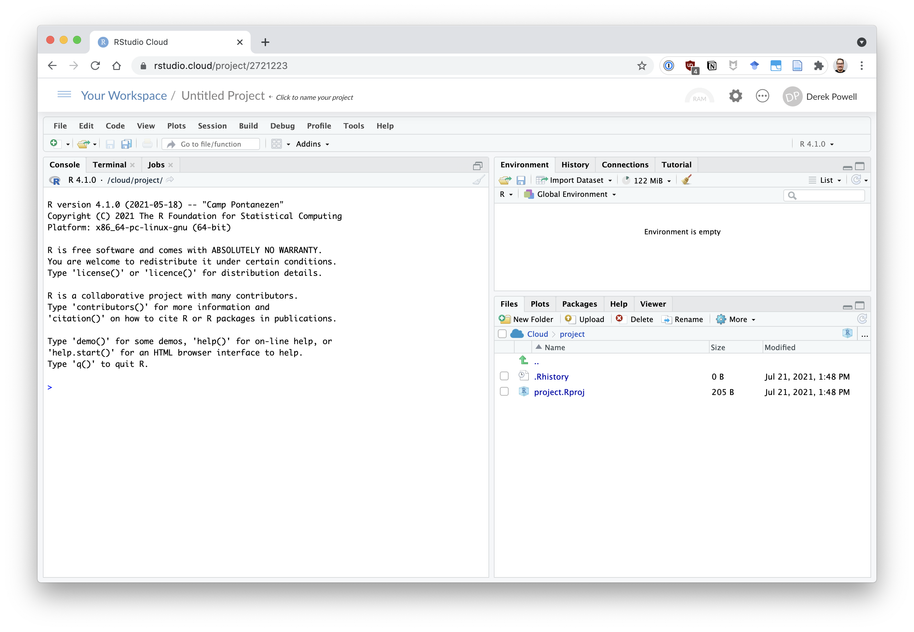

# Rstudio cloud

[Rstudio.cloud](https://Rstudio.cloud) is a website that lets you use a fully-functional instance of rstudio in your browser, without having to install anything on your own computer. This makes it easy to jump right into doing data analysis with R so you can focus on learning rather than IT.

## Creating an account

You should have received an email at your @asu.edu email address with the subject line: "SUBJECT LINE" inviting you to create an account on rstudio cloud for this class. Follow the links in the email and create a password for your account.

If you missed this email, search your inbox and spam folders. If you really didn't get it, reach out to the instructor.

## Accessing rstudio cloud

Navigate your browser to https://rstudio.cloud and log in using the credentials you just created.

## Organization: Workspaces and projects

Each student has their own "workspace" where all their projects are stored. The material for this class will be organized into Rstudio cloud projects, and will be pre-populated into your workspaces. You can also create your own projects, which you will eventually do for your final projects. Using your student account provided as part of this course, you can create an unlimited number of projects.

Click on the project "PROJECT NAME" to see an example.

# Rstudio

[_Learning Statistics with R_ ](https://learningstatisticswithr.com/lsr-0.6.pdf) (Sections 3.1.5 to 4.13) is your main resource for the basics of navigating R and Rstudio. But here are some quick pointers that might be useful.

## Interface Panes

Now you will be looking at an rstudio interface inside your browser, like this:

```{r fig-rstudio-example, echo=F, fig.align='center', out.width='75%'}

```

### Console

In the console pane you may type commands directly into the R console and see their outputs as they are executed. Try typing `2+2` and hitting ⏎Enter/Return.

### Source

At the top menu, if you choose `File -> New File -> Rscript` a new "source" pane will open above the console pane. This is where you will do most of your coding and editing of files, including scripts, notebooks, and other text-based files.

### Environment

At the upper-right you can see the "environment," all of the variables and objects that currently existing in memory for your R session. Try typing `x <- 2+2` into the R console to see `x` get added to your environment. (`<-` is the preferred "assignment operator" in R, and `alt + -` is a handy keyboard shortcut for it.)

### Files, plots, etc.

This pane has a number of tabs that allow it to serve different functions. 

#### Files

The first and primary tab is the "files" tab, which let's you see the folder and file structure available in your project. The files you see here are located on the rstudio "cloud" (server), not on your local machine. This should be clear from the directory structure shown in the files pane: {width=120px}.

One thing worth keeping in mind is that the rstudio cloud servers are run on Linux, so files and file paths will use Linux formatting, which is similar to Mac OS. Folders and subfolders are accessed with forward-/, rather than backslash-\\ as on Windows. Because your files will be stored in each project, you can typically use "relative paths," which start from the folder in which your scripts are located. So if you want to load a data file in a script, when both the script and data file are located in your project folder, you can simply use:

```
df <- read_csv("filename.csv")
```

Or, if the file is in a subfolder called `my-folder`, you can load it with:

```
df <- read_csv("my-folder/filename.csv")
```

#### Plots

Another important tab in this pane is the "plots" tab. Rstudio will automatically switch to this tab when you render a plot from the command window. 

#### Help

Help is never far away when you are working in rstudio. To pull up help and other information on how to use any R function, type the `?` followed by the function name into the console, and help will pop up in this pane. Try entering the command `?lm` to see help on the `lm()` function for conducting basic linear regressions.

# A quick tutorial

Let's take R out for a very quick spin.

## Loading packages 📦

We'll begin by loading in the [tidyverse](https://www.tidyverse.org/) set of R packages. 

An R "package" is a set of functions and tools. There are thousands of packages available for accompmlishing all kinds of tasks. Some are generally applicable, and some are really specific and special-purpose. 

The command below is actually a shortcut for loading a set of important packages that are often used together as part of the "tidy universe" ("tidyverse"). Among these are `tibble`, `dplyr`, `ggplot2`, and more---we'll dig into all of these packages in the next weeks.

```{r load-tidyverse, echo=T}
library(tidyverse)
```

## Loading and inspecting data

We'll load some data collected by Daniel Lakens in his introductory psychology course. He had students perform the classic "Stroop" task, requiring them to name the ink color in which either congruent or incongruent color words were printed (e.g. The word "Green" printed in green versus yellow ink). The classic finding is that reading interferes with color naming, so it takes longer to name the ink color when the word it is printing is "incongruent" (naming a different color) than if it is "congruent" (naming the same color).

Lakens has stored this data in a space-delimited file, which is not very standard. To read it, we need to use the `read_delim()` function and specify the delimiter as the space character. Typically in this class we will be using what are known as "comma-separated" files, or `.csv`. To read these, we will use the `read_csv()` function. Note that we can read this file in from a web URL, which can be very handy.

```{r}
stroop <- read_delim("https://raw.github.com/Lakens/Stroop/master/stroop.csv", delim=" ")
```

We can take a peek at this data using the `head()` function, which will show us the first 6 rows of the dataset.

```{r, echo=T}
head(stroop)
```
There are four variables:

* PPNR: the participant number
* Congruent: the total time taken to name ink colors on congruent trials
* Incongruent: the total time taken to name ink colors on incongruent trials
* Year: the year of participation (this has data from two classes)

## Data Munging

This data is in a "wide" format, where each row indicates a participants' times for both congruent and incongruent trials, saved as two separate variables. Often it is useful to rearrange data from "wide" to "long" format, which we can do using the `gather()` or `pivot_wider()` commands. Here's how we'd do that in this case:

```{r}
stroop %>% 
  gather(trial_type, RT, Congruent, Incongruent) %>% 
  arrange(PPNR) %>% 
  head()
```
Now there are two rows per subject, one with their congruent trial times and one with their incongruent times. Rearranging things like this is often useful.

I am also using the `%>%` operator (pipe) to string together these commands. This let's you "pipe" the results of one command in as the first argument of new command. That is, `stroop %>% head()` is equivalent to `head(stroop)`. To help you see what `gather()` has done, I've also sorted the rows by participant ID using `arrange(PPNR)` and again printed out the first 6 rows with `head()`.

You will get lots more explanation and practice with these tools as you work through the exercises in [_R for Data Science_](https://r4ds.had.co.nz/).

## Plotting

Before we do any statistics on this data, let's make a plot to visualize what the data look like. We can combine our data munging with the `ggplot2` package plotting tools to better understand our data. Below I use a "boxplot" to get a sense of the distribution of the response time values for the two trial types.

```{r, echo=T}
mini_stroop %>% 
  gather(trial_type, RT, Congruent, Incongruent) %>% 
  ggplot(aes(x=trial_type, y=RT)) +
  geom_boxplot(width=.5)
```
Looking at the plot, it should be very clear that participants have longer response times on the incongruent trials than on the congruent ones. This is an effect you can see with the naked-eye, so to speak. Once you get used to looking at data visualizations like this, you will start being satisfied just with the plots, and sometimes have no need for statistics at all!

## Statistics

Okay, okay, fine let's do a statistical test anyhow. Below is the code to conduct a simple paired t-test. Using the `$` lets me take a variable from the `stroop` data and pass it to the `t.test()` function. I do this for the two trial types in the `stroop` data: `stroop$Congruent` gives a vector of values for the congruent trials and `stroop$Incongruent` gives a vector of values for the incongruent trials. Then, I also set the argument `paired=TRUE` in the `t.test()` function so that we perform a paired rather than independent-samples t-test. 

Passing that all to `t.test()` prints out our results.

```{r, echo=T}
t.test(stroop$Congruent, stroop$Incongruent, paired=TRUE)
```

The result is significant. Stars! Stars for everyone!

## Scaling things up

What's great about working with R is that we use the exact same tools to handle larger datases as we do for simple datasets like our Stroop data. The tidyverse packages include a lot of useful functions, and they also include some datasets that can be useful for demonstration and testing purposes. We'll load one of them, the `billboard` dataset of the Billboard top 100 rankings in the year 2000. This dataset isn't large by any means, but it is larger than the Stroop data with 317 observations of 79 variables.

```{r, echo=T}
data(billboard)
```

Again, we can take a peek at this data using the `head()` function, which will show us the first 6 rows of the dataset.

```{r, echo=T}
head(billboard)
```
### Munging

This data is again in a "wide" format, where each track from the Billboard top 100 occupies a row, and its ranking each week is a separate variable. We use the same `gather()` command as before, though instead of writing out all the variables to gather, we use the shortcut `wk1:wk76` to gather weeks 1 through 76.

```{r, echo=T}
billboard %>% 
  filter(artist == "Spears, Britney") %>% 
  gather(week, ranking, wk1:wk76) %>% 
  head(9)
```

To make it easier to see what's going on, I've also first filtered for only Britney Spears' tracks (`filter(artist == "Spears, Britney")`), and I'm showing you the first 9 records (using `head(9)`). Remember the `%>%` pipes what's on the left into the function on the right as the first argument, so `x %>% head(9)` is like `head(x,9)`). 

### Plotting

We can combine our data munging with the `ggplot2` package plotting tools to better understand our data. Below I've created a plot showing the trajectories of a few hip-hop artists on the Billboard top-100 for the first half of the year 2000. The code below has comments to explain what each step is doing. You can leave comments in your code using `#` symbol; anything followd by a `#` will be ignored by R.

```{r fig-billboard-ex, echo=T, fig.align='center'}
billboard %>% 
  filter(
    artist %in% c("DMX", "2 Pac", "Eminem", "Dr. Dre", "Ghostface Killah")
    ) %>% # select only songs by these 5 hip-hop artists
  gather(week, ranking, wk1:wk76) %>% # transform the data into "long" format
  mutate(
    week = as.numeric(gsub("wk","", week)), # make the week variable numeric
    artist_track = paste(artist, track, sep=": ") # combine the artist and track variable for our plot legend
    ) %>% 
  drop_na() %>% # drop rows with missing data (later weeks when these tracks were out of the top 100)
  ggplot(aes(x=week, y = ranking, color=artist_track)) + # start building our plot
  geom_line() + # draw the lines
  ylim(100,1) + # reverse the y-axis so rank 1 is at the top
  theme_bw(base_size=12) + 
  labs(
    x="Week", 
    y = "Billboard ranking", 
    color="Artist & Song", 
    title="Billboard top 100 plotting example"
    )  # create nicer plot labels
```

Most of these tracks show a similar pattern of increasing popularity, a peak at different spots on the chart for different lengths of time, and then a fairly quick falling off. Two tracks, DMX's "Party Up" and Dre's "The Next Episode" fell off more rapidly than others though, dropping nearly 50 places to fall off the top 100 all in one week. 

What does that tell us about the music industry? I have no idea! But for a domain expert, visualization of this sort can be a useful kind of data sleuthing.

## Conclusions

Programming in R might seem a bit intimidating at first, and that's OK. We will be moving quickly, but we will break down all of the tools used here in more detail in the readings and next week. And, I'll continue to provide code and code translations for all the work we do in the course.