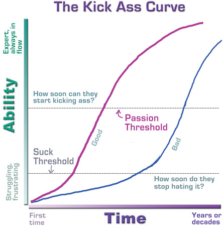

```{r setup, include=F}
knitr::opts_chunk$set(echo = FALSE)
library(tidyverse)
 
# this looks a bit off need to work out good defaults
theme_set(theme_gray(base_size=28))
```


## Why R? (or, why am I doing this to you?)

* R is a powerful tool for statistics
  * Packages exist for virtually any statistical analysis you can imagine
  * We will substitute programming in place of mathematical prowess
* R is a powerful tool for data management
  * Scripts and automation reduce errors, reduce tedium, and make analyses reproducible
* Programming is where the \$\$\$ is at
  * Basic programming knowledge is becoming a necessity in industry and academia

## Kicking ass

```{r kick-ass, fig.align='center', out.height="80%", fig.cap = "The Kick-Ass curve"}

```

## Rstudio tour

```{r rstudio, fig.align='center', out.height="80%", fig.cap = "The Rstudio interface"}
knitr::include_graphics("../images/rstudio-interface-init.png")
```

## Let's jump in

I'll show you ...

* scripts
* notebooks
* how to load data
* how to manipulate data
* how to plot data
* how to conduct a statistical test

## Interactive coding demo

Let's jump over to Rstudio, open a script, and run some code.

## Loading packages 📦

R "packages" are collections of code, functions, and data that have been packaged together. Typically, packages support conducting certain types of analyses, making plots, etc.

The most important set of packages we will learn in this course are the `tidyverse` packages.

```{r packages, echo=T}
library(tidyverse) # ggplot2, readr, dplyr, etc.
```

## Loading data

Let's load some data.

```{r load-stroop, echo=T}
df <- read_csv("stroop-2014.csv")
```

## Inspecting data with `head()`

We can inspect our data with the `head()` function (the `glimpse()` function is also useful).

```{r df-head, echo=T}
head(df)
```

## Checking for missing values

First let's check if we are missing any values. 

1. We will pass our `df` object to the `is.na()` function, which will give us a matrix of `TRUE/FALSE` values indicating whether the value was missing or not. 
2. Then we'll pass the output of `is.na()` into the `any()` function, which tells us if any of the values we give it are `TRUE`.

```{r check-na, echo=T}
any(is.na(df))
```

It looks like we aren't missing any data.

## Indexing from dataframes

Our `df` object is a dataframe (more specifically, a `tibble`) that consists of multiple variables. We can "index" or extract those variables using the `$` operator. Let's pull out the congruent trial data.

```{r indexing-vars, echo=T}
df$congruent
mean(df$congruent)
```

## Using and defining functions

Note that `mean()`, `any()`, and `is.na()` on the previous slides are _functions_ that perform some computation on whatever inputs they are given.

R includes many built-in functions, but sometimes we would like to do something new and unique. In those cases, we can define our own functions.

## Defining functions

One major omission in R is a built-in function to compute the standard error of a variable. R has a function `sd()` to compute the standard deviation, but nothing for the standard error. Recall, the formula for the standard error is:
$$SE = \frac{\sigma}{\sqrt{n}}$$
Let's make our own standard error function in R, named `se()`.

```{r def-se, echo=T}
se <- function(x){
  sd(x) / sqrt(length(x))
  }
```

## Computing standard error

Now we can use our function and compare the standard error to the standard deviation. Recall, $n = 48$, so $\sqrt{n}=6.93$.

```{r, echo=T}
sd(df$congruent)

se(df$congruent)
```

## Data tidying

Lots of data exists in "wide" format, where each row of a data table is a case with many variables. 

"Tidy" data is data in "long" format, where each row stores the value for one variable of one case.

## From wide to long with `gather()`

Let's convert our data from wide to long format using the `gather()` function and the "pipe" operator ` %>% `.

```{r wide-to-long, echo=T}
# convert to long format
df_long <- df %>% 
  gather(trial_type, rt, congruent, incongruent)
```

```{r, rows.print=6}
# see what happened
df_long %>% 
  arrange(subj_num) %>% 
  print(n=6)
```


## Selecting cases with `filter()`

Suppose subject #3 called us up with a confession: they were really distracted the day of the experiment and could hardly pay any attention. 

Now that we know that, maybe it's best to remove them from our dataset.

\small
```r
df %>% 
  filter(subj_num != 3)
```

```{r}
df %>% 
  filter(subj_num != 3) %>% 
  print(n=6)
```
\normalsize

## Renaming variables with `rename()`

Maybe we'd like to capitalize our condition name variables.

\small
```r
df %>% 
  rename(Incongruent = incongruent, Congruent = congruent)
```

```{r}
df %>% 
  rename(Incongruent = incongruent, Congruent = congruent) %>% 
  print(n=6)
```
\normalsize

## Creating new variables with `mutate()`

Things might feel more scientific if we store our response time measures as milliseconds (such precision!). We can compute new variables with the `mutate()` function.

\scriptsize
```r
df %>% 
  mutate(
    congruent_ms = congruent*1000,
    incongruent_ms = incongruent*1000
  )
```

```{r, echo=F}
df %>% 
  mutate(
    congruent_ms = congruent*1000,
    incongruent_ms = incongruent*1000
  ) %>% 
  print(n=6)
```
\normalsize

## Modifying categorical variables

The three commands below make the same changes.

\scriptsize

```r
df_long %>% 
  mutate(trial_type = ifelse(trial_type=="congruent", "Congrent", "Incongruent"))

df_long %>% 
  mutate(
    trial_type = fct_recode(
      trial_type, 
      "Congruent"="congruent", 
      "Incongruent"="incongruent")
    )

df_long %>% 
  mutate(
    trial_type = case_when(
      trial_type=="congruent" ~ "Congruent",
      trial_type=="incongruent" ~ "Incongruent"
    )
  )
```

\normalsize

## Basic plotting

```{r boxplot-example, echo=T, out.height="50%", fig.align='center'}
df_long %>% 
  ggplot(aes(x=trial_type, y=rt)) +
  geom_boxplot()
```

## Summarizing data

```{r summ-example, echo=T}
df_long %>% 
  group_by(trial_type) %>% 
  summarize(mean_rt = mean(rt), se_rt = se(rt))
```

## Plotting summarized data

```{r summ-plot-ex, echo=T,  out.height="50%", fig.align='center'}
df_long %>% 
  group_by(trial_type) %>% 
  summarize(mean_rt = mean(rt), se_rt = se(rt)) %>% 
  mutate(ul = mean_rt + se_rt, ll = mean_rt- se_rt) %>% 
  ggplot(aes(x=trial_type, y = mean_rt, ymin=ll, ymax=ul)) +
  geom_pointrange()
```

## Performing a t-test

\small
```{r ttest, echo=T}
t.test(df$congruent, df$incongruent, paired=TRUE)
```

## Creating publication-quality figures

:::::::::::::: {.columns align=center}
::: {.column width="60%"}
\scriptsize
```r
corr_val <- cor(df$congruent, df$incongruent)

df %>% 
ggplot(aes(x = congruent, y = incongruent)) + 
  geom_smooth(method="lm", alpha=.2) +
  geom_point() +
  annotate(
    "text", 
    x = 20, y = 13, 
    label=paste("r =", round(corr_val,3)), 
    size = 6) +
  theme_bw(base_size=16) +
  theme(
    aspect.ratio=1,
    panel.grid = element_blank()
    ) +
  labs(
    x = "Congruent RT (s)", 
    y = "Incongruent RT (s)"
    )
```
\normalsize
:::

::: {.column width="40%"}

```{r plot, message=F, fig.align='center', out.width="100%", fig.cap="Scatterplot of Stroop task response times"}
corr_val <- cor(df$congruent, df$incongruent)

df %>% 
ggplot(aes(x = congruent, y = incongruent)) + 
  geom_smooth(method="lm", alpha=.2) +
  geom_point() +
  annotate(
    "text", 
    x = 20, y = 13, 
    label=paste("r =", round(corr_val,3)), 
    size = 8) +
  theme_bw(base_size=28) +
  theme(
    aspect.ratio=1,
    panel.grid = element_blank()
    ) +
  labs(
    x = "Congruent RT (s)", 
    y = "Incongruent RT (s)"
    )
```
:::
::::::::::::::


## Exercise: data in the wild 

"How information about what is 'healthy' versus 'unhealthy' impacts children’s consumption of otherwise identical foods" (DeJesus citation).

```r
library(tidyverse)
df <- read_csv("dejesus-example.csv")
```

### Variables

* `child_id`: participant number for each child
* `condition`: whether the child was told the food was healthy
* `bites`: how many bites the child took
* `grams`: how much of the food they ate (g)

## Inspecting the data

Use the tools you just learned to start inspecting the data. As you do, ask yourself some questions:

:::::::::::::: {.columns}
::: {.column}
### Ask yourself
- Are we missing data for any observations?
- Do all the observed values make sense?
- Can we clean up these data? (safely?)
:::
::: {.column}
### Remember
- `head()`
- `View()`
- `is.na()` and `any()`
:::
::::::::::::::


::: notes
First we'll look then I'll show you how to answer of these Qs with R code.

Want them to:

* clean up variable naming
* deal with NAs
* notice impossible values
* fix them carefully (check if what we do is safe)
* finally, make a plot
* maybe, do a test
:::
