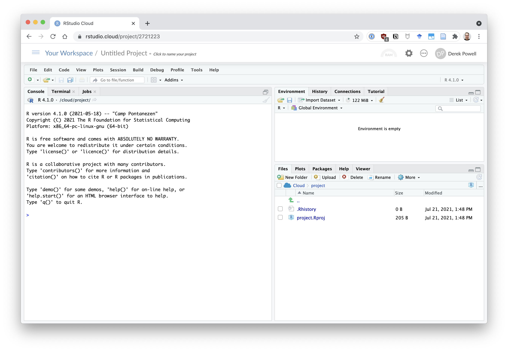

```{r setup, include=FALSE}
knitr::opts_chunk$set(echo = FALSE)
```

## R Markdown

This is an R Markdown presentation. Markdown is a simple formatting syntax for authoring HTML, PDF, and MS Word documents. For more details on using R Markdown see <http://rmarkdown.rstudio.com>.

When you click the **Knit** button a document will be generated that includes both content as well as the output of any embedded R code chunks within the document.

## Slide with Bullets

- Bullet 1
- Bullet 2
- Bullet 3

## Slide with R Output

```{r cars, echo = TRUE}
summary(cars)
```

## Slide with simulated R output

```r
summary(cars)
my_func <- function(x){x + 1}
```

```{r cars-silent}
summary(cars)
```


## Slide with Plot

```{r pressure}
plot(pressure)
```

## Slide With Image Left

::: columns

:::: column
### left
* some bullets
* over here
* and a longer point that should hopefully wrap around and not screw everything up!

$$\hat{y} = \alpha + \sum_i \beta_i x$$
::::

:::: column

```{r your-chunk-name, echo=FALSE, fig.cap="your-caption-name"}


#The figure will appear on the right side of the slide...
```
::::

:::

## a slide with different width columns

:::::::::::::: {.columns}
::: {.column width="40%"}
contents...
:::
::: {.column width="60%"}
contents...
:::
::::::::::::::


## A slide with a lot of bullets

Eventually it just starts cutting them off

* lorem ipsum 1
* lorem ipsum 2
* lorem ipsum 3
* lorem ipsum 4
* lorem ipsum 5
* lorem ipsum 6
* lorem ipsum 1
* lorem ipsum 2
* lorem ipsum 3
* lorem ipsum 4
* lorem ipsum 5
* lorem ipsum 6
* lorem ipsum 7
* lorem ipsum 8
* lorem ipsum 9
* lorem ipsum 10
* lorem ipsum 11
* lorem ipsum 12
