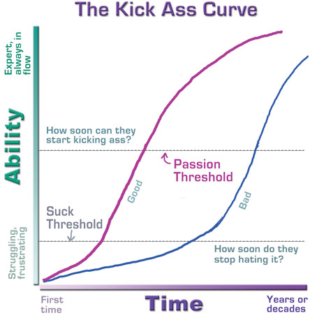
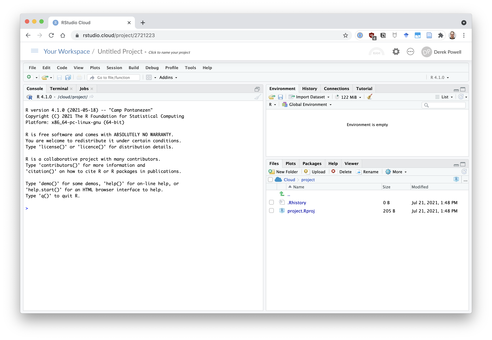

```{r setup, include=F}
knitr::opts_chunk$set(echo = FALSE)
library(tidyverse)
 
# this looks a bit off need to work out good defaults
theme_set(theme_gray(base_size=28))
```


## Why R? (or, why am I doing this to you?)

* R is a powerful tool for statistics
  * Packages exist for virtually any statistical analysis you can imagine
  * We will substitute programming in place of mathematical prowess
* R is a powerful tool for data management
  * Scripts and automation reduce errors, reduce tedium, and make analyses reproducible
* Programming is where the \$\$\$ is at
  * Basic programming knowledge is becoming a necessity in industry and academia
* R has a great community, tons of support, and is really not that hard to learn

## Kicking ass

```{r kick-ass, fig.align='center', out.height="80%", fig.cap = "The Kick-Ass curve"}

```

## Rstudio tour

```{r rstudio, fig.align='center', out.height="80%", fig.cap = "The Rstudio interface"}

```

## Let's jump in

I'll show you ...

* scripts
* notebooks
* how to load data
* how to manipulate data
* how to plot data
* how to conduct a statistical test

# Interactive coding demo

Let's jump over to Rstudio, open a script, and run some code.

## Loading packages 📦

R "packages" are collections of code, functions, and data that have been packaged together. Typically, packages support conducting certain types of analyses, making plots, etc.

The most important set of packages we will learn in this course are the `tidyverse` packages. We can load all of them at once with the command below:

```{r packages, echo=T}
library(tidyverse)
```

## Loading data

Let's load some data.

```r
df <- read_csv("stroop-2014.csv")
```

```{r load-stroop, include=F}
df <- read_csv("../data/stroop-2014.csv")
```

## Inspecting data with `head()`

We can inspect our data with the `head()` function.

```{r df-head, echo=T}
head(df)
```

## Checking for missing values

First let's check if we are missing any values. 


```{r check-na, echo=T}
any(is.na(df))
```


It looks like we aren't missing any data.

1. I passed our `df` object to the `is.na()` function, which will gave  a matrix of `TRUE/FALSE` values indicating whether the value was missing or not. 
2. Then I passed the output of `is.na()` into the `any()` function, which tells us if any of the values we give it are `TRUE`.

## Indexing from dataframes

Our `df` object is a dataframe that consists of multiple variables. We can "index" or extract those variables using the `$` operator. Let's pull out the congruent trial data.

```{r indexing-vars, echo=T}
df$congruent
```

## Using and defining functions

We can compute the mean of our congruent trials with:

```{r cong-mean, echo=T}
mean(df$congruent)
```

Note that `mean()`, `any()`, and `is.na()` on the previous slides are _functions_ that perform some computation on whatever inputs they are given.

R includes many built-in functions, but sometimes we would like to do something new and unique. In those cases, we can define our own functions.

## Defining functions

One major omission in R is a built-in function to compute the standard error of a variable. R has a function `sd()` to compute the standard deviation, but nothing for the standard error. Recall, the formula for the standard error is:
$$SE = \frac{\sigma}{\sqrt{n}}$$
Let's make our own standard error function in R, named `se()`.

```{r def-se, echo=T}
se <- function(x){
  sd(x) / sqrt(length(x))
  }
```

To learn more about this function, try typing `?sqrt` and `?length` into the R console.

::: notes
Try computing each of the components of this function, sd, sqrt, and length
:::

## Computing standard error

Now we can use our function to calculate the standard error.

:::::::::::::: {.columns align=center}
::: {.column}

### Using our function

```{r, echo=T}
se(df$congruent)
```

:::
::: {.column}

### Checking each piece

```{r, echo=T}
sd(df$congruent)
length(df$congruent)
sqrt(48)
3.700337 / 6.928203
```

:::
::::::::::::::

## Hands-on: Making your own function

Let's make a function to standardize the `congruent` and `incongruent` variables.

Recall our standard error equation and corresponding R function.

:::::::::::::: {.columns align=center}
::: {.column}
$$SE = \frac{\sigma}{\sqrt{n}}$$
:::
::: {.column}
```r
se <- function(x){
  sd(x) / sqrt(length(x))
  }
```
:::
::::::::::::::

How would you create a function to standardize a variable based on the equation?

$$Z = \frac{x-\mu}{\sigma}$$

# Working with data

## Removing cases with `filter()`

Suppose participant #3 called us up with a confession: they were really distracted the day of the experiment and could hardly pay any attention. Let's remove them from our dataset.

We will use the "pipe" operator ` %>% ` to pipe our data (`df`) to the `filter()` function. We can compare two variables with `==`, `!=`, `>`, `<`, `>=`, and `<=`.

\small
```r
df %>% 
  filter(subj_num != 3)
```

```{r}
df %>% 
  filter(subj_num != 3) %>% 
  print(n=4)
```
\normalsize

## Creating new variables with `mutate()`

Things might feel more scientific if we store our response time measures as milliseconds (such precision!). We can compute new variables with the `mutate()` function.

\scriptsize
```r
df %>% 
  mutate(
    congruent_ms = congruent*1000,
    incongruent_ms = incongruent*1000
  )
```

```{r, echo=F}
df %>% 
  mutate(
    congruent_ms = congruent*1000,
    incongruent_ms = incongruent*1000
  ) %>% 
  print(n=6)
```
\normalsize

## Renaming variables with `rename()`

Maybe we'd like to capitalize our condition name variables.

\small
```r
df %>% 
  rename(Incongruent = incongruent, Congruent = congruent)
```

```{r}
df %>% 
  rename(Incongruent = incongruent, Congruent = congruent) %>% 
  print(n=6)
```
\normalsize

## Stringing together actions with `%>%`

:::::::::::::: {.columns align=center}
::: {.column}

- The `%>%` operator pipes the output of one function into the next function as its first argument.
- For example, 
  ```r
  any(is.na(df))
  ```
  is the same as 
  ```r
  df %>% is.na() %>% any()
  ```
- This lets us string commands together, as shown here


:::
::: {.column}

\scriptsize
```r
df %>% 
  filter(subj_num != 3) %>% 
  mutate(
    congruent_ms = congruent*1000,
    incongruent_ms = incongruent*1000
  ) %>% 
  rename(
    Incongruent = incongruent, 
    Congruent = congruent
    ) 
```
\normalsize
:::
::::::::::::::


## Tidying data

:::::::::::::: {.columns align=center}
::: {.column}

The same data can be stored in different formats.

- __Wide format__: each row of a data table is a case with many variables. 
- __Long format__: each row stores the value for one variable of one case.

:::
::: {.column}

### Wide format
| case | x | y |
|------|------|------|
| a    | 2    | 4    | 
| b    | 3    | 6    | 

### Long format
| case | variable | value |
|------|----------|-------|
| a    | x        | 2     |
| a    | y        | 4     |
| b    | x        | 2     |
| b    | y        | 6     |

:::
::::::::::::::

## From wide to long with `gather()`

Let's convert our data from wide to long format using the `gather()` function.

```{r wide-to-long, echo=T}
df_long <- df %>% 
  gather(trial_type, rt, congruent, incongruent)
```

```{r}
# see what happened
df_long %>% 
  arrange(subj_num) %>% 
  print(n=6)
```

## From long to wide with `spread()`

Sometimes wide data is what we want. We can convert long data to wide data with the `spread()` function.

```{r long-to-wide, echo=T}
df_wide <- df_long %>% 
  spread(trial_type, rt)
```

```{r}
# see what happened
df_wide %>% 
  arrange(subj_num) %>% 
  print(n=6)
```
## Pivot functions

A recent update to the `tidyverse` is the introduction of the `pivot_longer()` and `pivot_wider()` functions.

- `pivot_longer()` = fancier but more complicated `gather()`
- `pivot_wider()` = fancier but more complicated `spread()`

I don't expect we will benefit from the extra complexity of `pivot_wider()` and `pivot_longer()` for most of what we do in this class.

## Summarizing data

* `group_by()` breaks the data into groups
* `summarize()` can be used with functions that take a vector input (from each group) and output a single number

```{r summ-example, echo=T}
df_long %>% 
  group_by(trial_type) %>% 
  summarize(mean_rt = mean(rt), se_rt = se(rt))
```

# Plotting data

## Basic plotting

:::::::::::::: {.columns align=center}
::: {.column width="40%"}

### Key `ggplot()` functions
- `ggplot()`: create a plot object
- `aes()`: specify the mapping of variables to plot elements
- `geom_boxplot()` (and other `geom_`s): draw something on the plot
- Note that ggplot elements are added to one another with `+`

:::
::: {.column width="60%"}

\small
```{r boxplot-example, echo=T, out.width="80%", fig.align='center'}
df_long %>% 
  ggplot(aes(x=trial_type, y=rt)) +
  geom_boxplot()
```
\normalsize

:::
::::::::::::::

## Plotting summarized data

```{r summ-plot-ex, echo=T,  out.height="50%", fig.align='center'}
df_long %>% 
  group_by(trial_type) %>% 
  summarize(mean_rt = mean(rt), se_rt = se(rt)) %>% 
  mutate(ul = mean_rt + se_rt, ll = mean_rt- se_rt) %>% 
  ggplot(aes(x=trial_type, y = mean_rt, ymin=ll, ymax=ul)) +
  geom_pointrange()
```

## Creating publication-quality figures (1)

:::::::::::::: {.columns align=center}
::: {.column width="60%"}
\scriptsize
```r
df_long %>%
  group_by(trial_type) %>%
  summarize(
    mean_rt = mean(rt),
    se_rt = se(rt)
  ) %>%
  mutate(
    ul = mean_rt + 1.96 * se_rt,
    ll = mean_rt - 1.96 * se_rt
  ) %>%
  ggplot(
    aes(
      x = trial_type, y = mean_rt,
      ymin = ll, ymax = ul
    )
  ) +
  geom_bar(
    stat = "identity", width = .5, fill = "grey"
    ) +
  geom_errorbar(width = .1) +
  theme_bw(base_size = 28) +
  theme(panel.grid = element_blank()) +
  labs(
    x = "Trial Type",
    y = "Response time (s)"
  )
```
\normalsize
:::

::: {.column width="40%"}

```{r barplot, message=F, fig.align='center', out.width="100%", fig.cap="Mean response times by trial type with 95\\% confidence intervals"}
df_long %>%
  group_by(trial_type) %>%
  summarize(
    mean_rt = mean(rt),
    se_rt = se(rt)
  ) %>%
  mutate(
    ul = mean_rt + 1.96 * se_rt,
    ll = mean_rt - 1.96 * se_rt
  ) %>%
  ggplot(
    aes(
      x = trial_type, y = mean_rt,
      ymin = ll, ymax = ul
    )
  ) +
  geom_bar(
    stat = "identity", width = .5, fill = "grey"
    ) +
  geom_errorbar(width = .1) +
  theme_bw(base_size = 32) +
  theme(panel.grid = element_blank()) +
  labs(
    x = "Trial Type",
    y = "Response time (s)"
  )
```
:::
::::::::::::::


## Creating publication-quality figures (2)

:::::::::::::: {.columns align=center}
::: {.column width="60%"}
\scriptsize
```r
corr_val <- cor(df$congruent, df$incongruent)

df %>% 
ggplot(aes(x = congruent, y = incongruent)) + 
  geom_smooth(method="lm", alpha=.2) +
  geom_point() +
  annotate(
    "text", 
    x = 20, y = 13, 
    label=paste("r =", round(corr_val,3)), 
    size = 6) +
  theme_bw(base_size=16) +
  theme(
    aspect.ratio=1,
    panel.grid = element_blank()
    ) +
  labs(
    x = "Congruent RT (s)", 
    y = "Incongruent RT (s)"
    )
```
\normalsize
:::

::: {.column width="40%"}

```{r plot, message=F, fig.align='center', out.width="100%", fig.cap="Scatterplot of Stroop task response times"}
corr_val <- cor(df$congruent, df$incongruent)

df %>% 
ggplot(aes(x = congruent, y = incongruent)) + 
  geom_smooth(method="lm", alpha=.2) +
  geom_point() +
  annotate(
    "text", 
    x = 20, y = 13, 
    label=paste("r =", round(corr_val,3)), 
    size = 8) +
  theme_bw(base_size=28) +
  theme(
    aspect.ratio=1,
    panel.grid = element_blank()
    ) +
  labs(
    x = "Congruent RT (s)", 
    y = "Incongruent RT (s)"
    )
```
:::
::::::::::::::

# Performing a t-test

\small
```{r ttest, echo=T}
t.test(df$congruent, df$incongruent, paired=TRUE)
```

# Hands-on exercise: Data in the wild

"How information about what is 'healthy' versus 'unhealthy' impacts children’s consumption of otherwise identical foods" (DeJesus et al., 2019).

### In Experiment 1 of this study:

- Researchers presented children (aged XX to XX) with two food options
- They told the children that one of the foods was healthy and the other was unhealthy
- Then they left children alone with the food and allowed them to eat if they wanted
- A research assistant observed through a camera and recorded the number of bites the children took
- After each child finished, reseachers weighed the remaining food in the dish to calculate how many grams of food the children ate

## Hands-on: Loading the data

### Load data from this paper yourself

The data is stored in the file `dejesus-example.csv`.

```{r, include=F}
library(tidyverse)
dejesus <- read_csv("../data/dejesus-example.csv")
```


### Data processing goals

Let's create a new tibble called `dejesus_cleaned` where we

* Include only the second trials for each child from Experiment 1
* Rename variables to be a bit clearer
* Remove some unnecessary variables

## Hands-on: Cleaning things up

### Variables we'd like

* `child_id`: participant number for each child
* `condition`: whether the child was told the food was healthy
* `bites`: how many bites the child took
* `grams`: how much of the food they ate (g)

### Instructions

1. Look at the data with `head()`, `glimpse()` or `View()`
2. Filter for the 2nd trial from Exp. 1 using `filter()` (Exp. 1 is called "1_healthy_unh")
3. Rename variables to be a bit clearer using `rename()`
4. Remove unnecessary variables with `select()`
  
I didn't show you `select()`, take a look at the help with `?select` to learn about it.

```{r, include=F}
dejesus_cleaned <- dejesus %>% 
  filter(study=="1_healthy_unh", trial==2) %>% 
  rename(child_id = pnum, condition = food_gen) %>% 
  select(child_id, condition, bites, grams)
```

::: notes
* why bother renaming things? did you know what food_gen meant? presumably the authors do, but it could be hard to remember
:::

## Hands-on: Inspecting the data

Now use the tools you've just learned to do some data sleuthing.

:::::::::::::: {.columns}
::: {.column}
### Ask yourself
- Are we missing data for any observations?
- Do all the observed values make sense?
- Can we fix or clean up these data? (how?)
:::
::: {.column}
### Remember
- `head()` and `View()`
- `is.na()` and `any()`
- `filter()`
- plotting with `geom_point()`
:::
::::::::::::::

::: notes

scale is supposed to have .1g accuracy, which means 1sd to measurements. .1 to .2 is within 1-2sd. if we think a .5g bite is possible, then .3g observation could be 2sd off a .5g bite, rather than 3sd off a 0g bite. But it's hard to know without knowing the accuracy of the "bite" observers. 

We could treat this as a statistical inference problem, but lets save ourselves for more intresting issues. We can probably safely recode the .1 and .2 on zero bites as zeros. It's not as clear what to do with the .3 on 1 bite.

:::

```{r, include=F}
any(is.na(dejesus_cleaned))

head(dejesus_cleaned)

# can't be any grams gone if zero bites
dejesus_cleaned %>% 
  filter(bites==0, grams > 0) %>% 
  count(grams)

# can we trust the bites coding? let's look at what 1 bite looks like

# was 42, healthier miscoded? maybe, tho probably not
dejesus_cleaned %>% 
  filter(bites==1, grams < 1) %>% 
  count(grams)
```
::: notes

Want them to:

* clean up variable naming
* deal with NAs
* notice impossible values
* fix them carefully (check if what we do is safe)
* finally, make a plot
* maybe, do a test
:::

## Hands-on: Inspecting with plotting

Plotting can help us look for outliers or possible data-entry errors.

```{r inspect-plot, echo=T, fig.align='center', out.height="50%"}
dejesus_cleaned %>% 
  ggplot(aes(x=bites, y = grams)) +
  geom_point()
```

## Hands-on: Fixing the dataset

* A number of trials where children took zero bites show non-zero amounts of food being eaten according to grams
* These are most likely measurement errors, due to the inaccuracies of scales for small weights.
* If we like, we can fix these measurement errors using the `if_else()` function. The function takes 3 arguments, like so:

`if_else(condition, value_if_true, value_if_false)`

```{r, echo=T}
dejesus_cleaned <- dejesus_cleaned %>% 
  mutate(
    grams = if_else(bites==0, 0, grams)
    )
```


```{r, include=F}
## are there any other suspicious values? we could look at a scatterplot
dejesus_cleaned %>% 
  ggplot(aes(x=bites, y = grams)) +
  geom_jitter(width=.1)

## we can spot a weird point for bites = 3, let's see what it really is 
## now what to make of 3 bites for .9g? and 2 bites for 
dejesus_cleaned %>% 
  filter(bites==3 | bites==2) %>% 
  arrange(grams)

## Maybe we should drop those two funky values as unreliable
dejesus_cleaned <- dejesus_cleaned %>% 
  mutate(
    grams = ifelse(bites==0, 0, grams),
    grams = ifelse(bites > 1 & grams < 1, NA, grams),
    bites = ifelse(bites > 1 & grams < 1, NA, bites),
    )

dejesus_cleaned %>% 
  ggplot(aes(x=condition, y = grams, fill=condition)) +
  geom_violin(width=.5) +
  geom_jitter(width=.1) +
  theme(legend.position = "none")
```

# Extra slides

## Modifying categorical variables

The three commands below make the same changes.

\scriptsize

```r
df_long %>% 
  mutate(trial_type = ifelse(trial_type=="congruent", "Congrent", "Incongruent"))

df_long %>% 
  mutate(
    trial_type = fct_recode(
      trial_type, 
      "Congruent"="congruent", 
      "Incongruent"="incongruent")
    )

df_long %>% 
  mutate(
    trial_type = case_when(
      trial_type=="congruent" ~ "Congruent",
      trial_type=="incongruent" ~ "Incongruent"
    )
  )
```

\normalsize
