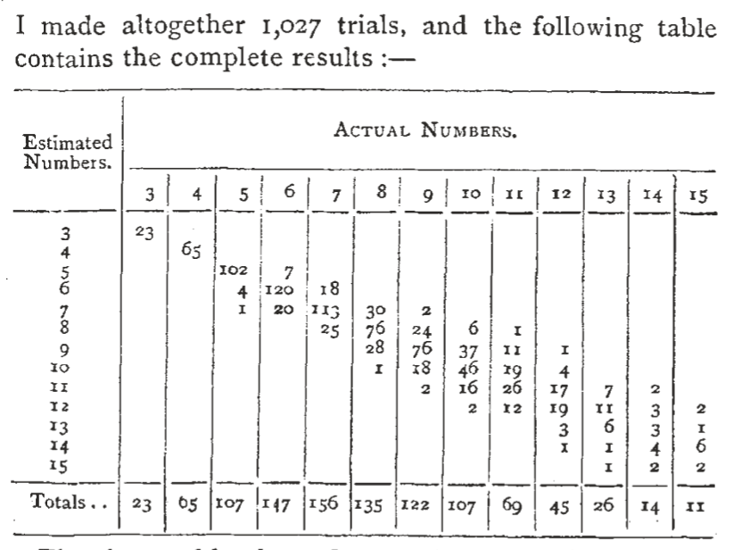

```{r setup, include=FALSE}
knitr::opts_chunk$set(echo = FALSE)
library(tidyverse)
set.seed(1623464)
```

<!-- This lecture borrows heavily from Statistical Rethinking Ch.3 and Bayes Rules! Ch.3  -->

## Bayes' rule

### Bayes' rule equation

$$P(h|d) = \frac{P(d|h)P(h)}{P(d)}$$

### Components

- Posterior: $P(h|d)$
- Likelihood: $P(d|h)$
- Prior: $P(h)$
- Normalizing constant: $P(d)$

## Bayes rule at work

Suppose we are vampire hunters and our lab has just processed a positive blood test for vampirism. We can calculate the probability that the suspect is a vampire as:

$$ P(vampire|positive) = \frac{P(positive|vampire)P(vampire)}{P(positive)} $$
where 

\begin{multline*}
P(positive) = \\
P(positive|vampire)P(vampire) + P(positive|\neg vampire)P(\neg vampire)
\end{multline*}

## Diagnosing vampirism

$$ P(vampire|positive) = \frac{P(positive|vampire)P(vampire)}{P(positive)} $$
Suppose the test successfully detects vampirism 95% of the time, and only issues a false-positive 1% of the time. Of course, vampires are rare, only 0.1% of the population.

\small
```{r vampire-test, echo=T}
p_pos_g_vamp <- .95
p_pos_g_human <- .01
p_vamp <- .001
p_pos <- p_pos_g_vamp*p_vamp + p_pos_g_human*(1-p_vamp)

(p_pos_g_vamp * p_vamp) / p_pos
```
\normalsize

## Cool, are we Bayesians now?

Not really.

- Bayes rule isn't really Bayesian
- Everything we just did could be based on the frequencies of events

::: notes
Bayes simultaneously gets too much credit and not enough. Not enough because Bayes theorem has become fundamental to all modern statistics, including non-bayesian approaches. Too much because Laplace is really the one who began developing the math to actually apply Bayes' rule in statistical inference.

Key insight is that we can decompose the joint probability distribution in a really useful way
:::

## Counting up what can happen

Everything we just did could be based on the frequencies of events

- 100 out of 100,000 people are vampires (0.1%)
- 95 out of 100 tests on vampires will be positive (95%)
- 1 out of 100 tests on humans will be posiive (1%)

But we can also turn this logic around: any computation we'd like to do with probabilities can be approximated by working with _samples_ from the probabilitiy distribution and counting up what happens.

## Creating a grid-approximate posterior

Recall the grid approximation of the posterior of the globe-tossing data from Chapter 2 of _Statistical Rethinking_: 

$$\text{W L W W W L W L W}$$

```{r make-grid-approx, echo=T}
p_grid <-  seq(0, 1, length.out=1000)
prior <-  1
likelihood <-  dbinom(6, 9, prob=p_grid)
posterior <-  likelihood*prior
posterior <- posterior/sum(posterior)
```

## Sampling from a grid-approximate posterior

\small

```{r sample-grid-approx, echo=T, message=F}
samples <- sample(p_grid, prob = posterior, size=1e4, replace=T)
```

\normalsize

```{r plot-grid-samples, fig.align='center', fig.dim=c(4,2)}
ggplot() +
  geom_histogram(mapping=aes(samples), binwidth=.01, fill="skyblue") +
  geom_line(mapping=aes(x = p_grid, y = posterior*1e4*1000/100), color="red") +
  theme_bw() 
```

We estimate the ___probability density___ with the ___count___ of samples at each point on the grid.

## Why use samples?

Samples provide a convenient and powerful way of working with the probability distribution itself. Samples are how we trade in math for programming.

### Samples can also summarize

* Compute intervals from boundaries (e.g. $x > .50$)
* Compute intervals of defined mass (e.g. 95% CI)
* Compute point estimates

## Estimating bounded intervals

What is the probability that more than half the globe is water?

```{r bounded-interval, echo=T}
mean(samples > .50)
```

```{r plot-bounded-interval, fig.align='center', fig.dim=c(3,2)}
ggplot() +
  geom_histogram(mapping=aes(x=samples, fill=samples>=.50), binwidth=.0101) +
  scale_fill_manual(values = c("grey", "skyblue")) +
  theme_bw() +
  theme(legend.position = "none")
```


## Estimating intervals of defined mass

:::::::::::::: {.columns align=bottom}
::: {.column}

### "credible intervals"

Below is a 50% credible interval.

\scriptsize

```{r, echo=T}
quantile(samples, c(.25, .75))
```

```{r plot-cred-interval, fig.align='left', fig.dim=c(2,1.4)}

ggplot() +
  geom_histogram(mapping=aes(x=samples, 
                             fill = samples > quantile(samples, .25) & samples < quantile(samples,.75)), binwidth=.0101) +
  scale_fill_manual(values = c("grey", "skyblue")) +
  theme_bw(base_size=10) +
  theme(legend.position = "none") +
  labs(x=expression(pi))
```

:::
::: {.column}

### Highest Posterior Density Intervals (HPDI)

Below is a 50% HPDI

\scriptsize
```{r, echo=T}
rethinking::HPDI(samples, .50)
```

```{r plot-hpdi-interval, fig.align='right', fig.dim=c(2,1.4)}
samples_hpdi <- rethinking::HPDI(samples, .50)

ggplot() +
  geom_histogram(mapping=
                   aes(x=samples, 
                       fill = samples > samples_hpdi[1] & samples < samples_hpdi[2]), binwidth=.0101) +
  scale_fill_manual(values = c("grey", "skyblue")) +
  theme_bw(base_size=10) +
  theme(legend.position = "none") +
  labs(x=expression(pi))
```

:::
::::::::::::::


## Point estimates
```{r, include=F}
Mode <- function(x) {
  ux <- unique(x)
  ux[which.max(tabulate(match(x, ux)))]
}
```

- ___Maximum A-Posteriori___ Estimate (MAP)
  - Equivalent to the posterior mode

```{r, echo = T}
Mode(samples)
```

- Posterior mean
```{r, echo=T}
mean(samples)
```

- Posterior median
```{r, echo=T}
median(samples)
```

:::notes
Our posterior is a little lopsided, so you can see that the MAP is a bit higher than the median and mean.
:::

# Psychological examples

## Example 1: The Milgram experiments

-overview of experiment

## The Beta-Binomial model

McElreath's "globe tossing" model is actually an example of the ___beta-binomial___ model, a model for a rate or proportion $\pi$.

$$y \stackrel{iid}{\sim} binomial(n,\pi)$$
$$\pi \sim beta(\alpha, \beta)$$

:::::::::::::: {.columns}
::: {.column}

### Components of the model
- $beta$ prior distribution
- $binomial$ likelihood distribution
- $beta$ posterior for $\pi$

:::
::: {.column}

### Computing the posterior

Observing $s$ successes and $m$ failures, the posterior $\pi$ is:

$$\pi|y \sim beta(\alpha + s, \beta + m)$$
An elegant example of ___conjugate priors___.

:::
::::::::::::::

## Milgam's morals 

> “If we fail to intervene, although we know a man is being made upset, why separate these actions of ours from those of the subject, who feels he is causing discomfort to another ... why do we feel justified in carrying through the experiment, and why is this any different from the justifications that the obedient subjects feel.” ---Stanley Milgram ([source](http://www.gina-perry.com/2013/11/13/kohlberg-milgram-and-morals/))

Imagine Milgram actually began as a fairly ethical man. What must he have thought would happen in his experiments such that they would be acceptable to perform?

:::notes
It's hard to know what's in another person's heart. We do know that Milgram would go on to conduct his study on hundreds of naive subjects without ever publicly expressing regret at the harm he caused them. However, he did privately acknowledge his precarious moral position
:::

## Milgram's priors

For his experiments to be ethically permissible, Milgram would have had to have believed that very few, if any, participants would obey the instruction to give lethal shocks.

That is, he must have had a relatively strong prior over $\pi$, the rate at which participants would obey.

## Summarizing Milgram's priors

Let's say our Moral Milgram had a prior for $\pi \sim beta(1, 15)$

```{r moral-milg-prior-fig, fig.dim=c(3,2), fig.align='center'}
tibble(
  p_grid = seq(0,1, length.out=1e3),
  p = dbeta(p_grid, 1, 15)
) %>% 
  ggplot(aes(x=p_grid, y=p)) +
  geom_line() +
  theme_bw() +
  labs(x=expression(pi), y = "density")
```

How confident is our Moral Milgram that fewer than 10% of participants would administer the lethal shock?

\small
```{r, echo=T}
milgrams_prior <- rbeta(1e4, 1, 15)
mean(milgrams_prior < .10)
```

\normalsize

## Computing Milgram's posterior

In Milgram's original 1963 study, 26 of 40 volunteers obeyed the order to administer a "lethal" electric shock.

We can update our $beta(1, 15)$ prior by simply adding the observed "successes" and "failures" to the $\alpha$ and $\beta$ parameters of the prior distribution.

$$\pi|y \sim beta(1 + 26, 15 + 14)$$

## Sampling from Milgram' posterior

We can sample directly from this distribution with the function `rbeta()`.

```{r, echo=T}
milgrams_posterior <- rbeta(1e4, 1 + 26, 15 + 14)
```

And plot these samples

```{r moral-milg-post-fig, fig.dim=c(3,2), fig.align='center'}
# tibble(
#   p_grid = seq(0, 1, length.out=1e3),
#   p = dbeta(p_grid, 1+26, 15+14)
# ) %>% 
#   ggplot(aes(x=p_grid, y=p)) +
#   geom_line()

ggplot() + 
  geom_histogram(aes(milgrams_posterior), binwidth=.01, fill="skyblue") +
  theme_bw() +
  labs(x = "posterior probability")
```

## Prior, likelihood, and posterior

### Priors matter! 

- Milgram's prior biases the estimates, compare against a model with uniform prior

### But likelihoods matter more

- But the posterior has moved a ton from the prior
- With enough data, the likelihood comes to "dominate" the prior

## Hands-on: Milgram pausing to think

Imagine Moral Milgram considered his findings after 8 participants, 5 of whom administered the "lethal" shock.

- Compute our model's posterior for $\pi$ after these 8 observations.
- Consider Milgram's initial 80% confidence that fewer than 10% of participants would administer all the shocks---according to our model, what should his confidence be now?
- Starting out, Milgram was almost certain fewer than 30% of participants would administer the shocks. Compare the probability from his prior to the model's belief after 8 cases.

:::notes
A Moral Milgram would stop and think about his experiment as he conducted it. 
:::

## Example 2: The power of numerical discrimination

- Jevons (1871) took a handful of black beans and tossed them at a white shallow container surrounded by black cloth
- On each toss, a certain number of beans would land in the square and he would then look and try to immediately call out their number
- Then he counted how many beans there actually were in the container, and recorded the result.

```{r jevons-results-img, out.height="45%", fig.align='center', fig.cap="Jevons (1871) results from his bean-tossing experiment."}

```


:::notes
He made 1027 trials, so he did this basically until he got bored.
:::

## A bean-tossing model

```{r, include=F}
jevons <- tribble(
  ~true_beans, ~correct, ~incorrect,
  3, 23, 0,
  4, 65, 0,
  5, 102, 5,
  6, 120, 27,
  7, 113, 43,
  8, 76, 59,
  9, 76, 46,
  10, 46, 61,
  11, 26, 43,
  12, 19, 26,
  13, 6, 20,
  14, 4, 10,
  15, 2, 11
)
```

- We will use the same beta-binomial model as before:

$$y \stackrel{iid}{\sim} binomial(n,\pi)$$
$$\pi \sim beta(\alpha, \beta)$$

- We'll focus on the "small world" where the true number of beans was 4, where Jevons was correct 65 out of 65 times
- For illustration, we will assume a uniform or uninformative prior $beta(1,1)$
- We can then compute the posterior as

$$ \pi|y \sim beta(1 + 65, 1 + 0)$$

## Sampling the model posterior

`rbeta()` is great, but it can do some funky things near the extreme values of zero and one. For that reason, I'm going to create my own `grid_approx_rbeta()` function that draws samples from a grid approximated posterior. 

\small
```{r, echo=T}
grid_approx_rbeta <- function(n, shape1, shape2, grid_size=1000){
  p_grid <-  seq(0, 1, length.out=grid_size)
  prob <- dbeta(p_grid, shape1, shape2)
  prob <- prob/sum(prob)
  
  sample(p_grid, prob=prob, size=n, replace=T)
}

beans4_posterior <- grid_approx_rbeta(1e4, 1 + 65, 1 + 0)
```

## Estimating intervals of defined mass

Let's visualize a 56% credible interval and a 56% HPDI of $\pi|y$.

Do you see anything strange about either of these?

```{r beans-interval-ex, fig.align='center', fig.width=4, fig.height=2}
library(patchwork)
beans_hpdi <- rethinking::HPDI(beans4_posterior, .56)
tibble(
  p = beans4_posterior,
  x = p < quantile(beans4_posterior, .22) | p > quantile(beans4_posterior, 1-.22),
  name = "Credible Interval"
) %>% 
  bind_rows(
    tibble(
    p = beans4_posterior,
    x = p < beans_hpdi[1] | p > beans_hpdi[2],
    name = "HPDI"
  )
  ) %>% 
  ggplot(aes(x=p, fill=x)) +
  geom_histogram(binwidth=.001) +
  scale_fill_manual(values = c("skyblue","grey")) +
  facet_wrap(~name) +
  theme_bw() +
  theme(legend.position="none") +
  labs(x = expression(pi))
```

:::notes
McElreath likes to use 89% and other "odd" intervals as examples, to illustrate the arbitrariness of the standard 95% confidence interval. So this is giving the man his due.
:::

## The trouble with point-estimates

Consider the MAP point-estimate:

```{r, echo=T}
Mode(beans4_posterior)
```

- If Jevons throws some more beans, how much would you bet that he estimates correctly if there are 4 beans in the tray?
- A probability of 1 implies says you should take _any bet_: If he's right you get \$1, if he's wrong you owe \$1,000,000 is a good bet if the probability is 1.

:::notes
As before we can create point estimates to summarize the posterior distribution using our samples. 
- One way of thinking about probability is in terms of the gambles you'd be willing to make
- Hopefully it's obvious that that is not really a good bet, and that the MAP is a poor summary point-estimate here.

:::

## Choosing point estimates

In this case, the posterior mean or median make for more reasonable summaries:

```{r, echo=T}
mean(beans4_posterior)
median(beans4_posterior)
```

The MAP, posterior mean, and posterior median are typical point-estimates in most of science. Generally, it's better to use the whole distribution when we have it.

## And then there were 5 (beans)

Let's compare our model of the Jevon's bean-guessing when the true number of beans is four to a model of the situation when the true number of beans is five. 

The posteriors for Jevons' success rate in this case is:

$$\pi|y_{5} \sim beta(1 + 102, 1 + 5)$$
```{r}
# plot their distributions
beans5_posterior <- grid_approx_rbeta(1e4, 1 + 102, 1 + 5)
```

## Comparing posteriors with summaries

:::::::::::::: {.columns}
::: {.column}

### Four beans
\scriptsize
```{r, echo=T}
mean(beans4_posterior)
quantile(beans4_posterior, c(.025, .975))
```


:::
::: {.column}

### Five beans
\scriptsize
```{r, echo=T}
mean(beans5_posterior)
quantile(beans5_posterior, c(.025, .975))
```
:::
::::::::::::::


:::notes
what can you conclude from this?
:::

## Comparing posteriors with samples

```{r, fig.dim = c(4,2), fig.align='center'}
tibble(
  samps = beans4_posterior,
  beans = 4
) %>% 
  bind_rows(
    tibble(
      samps = beans5_posterior,
      beans = 5
    )
  ) %>% 
ggplot(aes(x=samps, fill=factor(beans))) +
  geom_histogram(position="identity", alpha=.5, binwidth=.001) +
  theme_bw() +
  labs(fill="beans", x = expression(pi))
```

What is the probability that Jevons' success rate is lower for five beans than for four?

```{r, echo=T}
mean(beans4_posterior > beans5_posterior)
```

## Computing new quantities with samples

What is the difference in Jevon's success rates are when there are four beans compared with when there are five? i.e. what is the distribution of $\pi|y_4 - \pi|y_5$?

```{r, echo=T}
success_diff <- beans4_posterior - beans5_posterior

Mode(success_diff)

quantile(success_diff, c(.025, .975))
```

```{r, fig.dim = c(2.5,1.5), fig.align='center'}
# ggplot() +
#   geom_histogram(aes(success_diff), binwidth=.005) +
#   geom_vline(xintercept=0, linetype="dashed") +
#   theme_bw() +
#   labs(x="Difference in success rates")
```

How would you do this without samples? 

- ___You wouldn't!___
  - There is no nice, closed-form solution to this problem!
  - Although the result here is nice and could be approximated
  

## Hands-on: What about priors?

In this example I played dumb with an uninformative $beta(1,1)$. In reality, Jevons should have believed that he could be quite accurate in estimating the number of 3, 4, or 5 beans, certainly that his accuracy would be at least 90% or so.

- Propose an informative prior distribution that could roughly capture what Jevons thought before he collected his data
- Compute a new posterior distribution for four and five beans with this prior (you can use `rbeta()`)
- Calculate the probability Jevons' accuracy is better with four beans by comparing the posterior distributions 
- Compared with the results with the uniform prior, what changed? Why?

:::notes
a good prior would be something like Beta(50,1)

the posterior of 4beans gets shifted more than posterior of 5beans and both distributiosn get more narrow, so we get a bit more confident (tho not that different)
:::

## Hands-on: Keep tossing?

- Is Jevons really perfect? Where is the line for perfection in a task like this?
- Let's say we want to be at least 50% confident he is at least 99% accurate. How many successes would we need to observe in a row to achieve this confidence if we begin with a uniform $beta(1,1)$ prior?
- Suppose Jevons makes one mistake, how many total successes would we need to reach the same confidence?

:::notes
70 is a good answer with no failures
167 is a good answer with 1 failure
:::

## Hands-on: Simulating data

- If Jevons makes one mistake on trial 65, he would need 102 correct in a row to reach 50% confidence he is at least 99% accurate.
- The code below simulates 1,000,000 bean-tossing trials assuming that Jevons is actually 99.1% accurate using the `rbernoulli()` function. 
  - Use these simulated samples to calculate the probability that Jevons gets at least 102 in a row
  - Use `dbinom()` to calculate the probability of Jevons getting 102 out of 102 trials when $\pi = .991$ 
  - What do you notice?

```{r, echo=T}
x <- rbernoulli(1e6, .991)
runs <- rle(x)
run_lengths <- runs$lengths[runs$values==TRUE]
```

```{r, include=F}
mean(run_lengths >= 102)
dbinom(102, 102, .991)
```


:::notes
This is just to show you that all is right with the universe when we use probabilities
:::